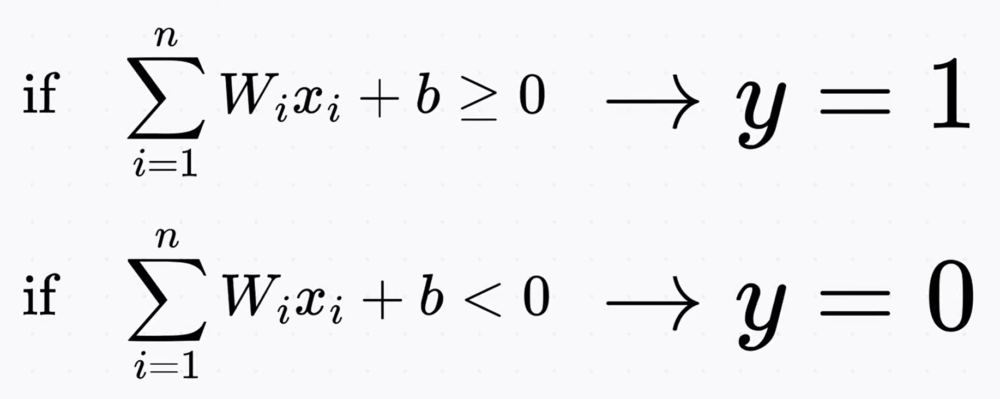

# 🧠 퍼셉트론 (Perceptron): 인공 뉴런의 시작

이번 시간에는 인공 신경망을 이루는 가장 기본적이면서도 중요한 벽돌, 바로 **퍼셉트론(Perceptron)** 에 대해 알아보겠습니다. 퍼셉트론은 **'인공 뉴런(Artificial Neuron)'** 이라고도 불리며, 우리 뇌의 뉴런이 동작하는 방식에서 영감을 얻어 만들어졌습니다.

초기 퍼셉트론은 주어진 데이터를 두 개의 그룹 중 하나로 분류하는 **이진 분류(Binary Classification)** 문제를 해결하기 위해 탄생했습니다. 예를 들어 '이 이메일은 스팸인가, 아닌가?' 또는 '이 사진은 고양이인가, 강아지인가?'와 같이 'Yes' or 'No'를 판단하는 문제에 주로 사용되었죠.

## 퍼셉트론은 어떻게 구성될까요?

퍼셉트론의 구조는 생각보다 간단합니다. 여러 개의 입력을 받아 하나의 결과를 내보내는 형태이죠.

- **입력값 (Inputs, `x`)**: 뉴런이 판단을 내리기 위해 받는 데이터나 신호를 의미합니다.
- **가중치 (Weights, `w`)**: 각각의 입력값이 얼마나 중요한지를 나타내는 값입니다. 가중치가 클수록 해당 입력값이 결과에 더 큰 영향을 미칩니다.
- **노드 (Node)**: 입력값과 가중치를 곱해 모두 더한 후, 이 값을 처리하여 최종 결과를 내보내는 핵심 처리 장치입니다. 실제 뇌의 뉴런에 해당합니다.

## 퍼셉트론은 어떻게 결정을 내릴까요?

퍼셉트론이 'Yes' 또는 'No' (1 또는 0)를 결정하는 과정은 크게 두 단계로 나뉩니다.

#### **1단계: 모든 신호 종합하기 (Weighted Sum)**

먼저, 각각의 입력값(`x`)에 해당 가중치(`w`)를 곱한 값들을 모두 더합니다. 그리고 여기에 **편향(bias, `b`)** 이라는 값을 추가로 더해줍니다. 편향은 뉴런이 얼마나 쉽게 활성화될지를 조절하는 역할을 합니다.

#### **2단계: 활성화 여부 결정하기 (Activation Function)**

신호를 모두 종합한 값이 특정 **임계값(Threshold)** 을 넘으면 '활성화'하여 **1**을 출력하고, 넘지 못하면 '비활성화' 상태를 유지하며 **0**을 출력합니다. 이처럼 신호를 받아 활성화 여부를 결정하는 함수를 **활성화 함수(Activation Function)** 라고 합니다.

퍼셉트론에서는 주로 **계단 함수(Step Function)** 가 활성화 함수로 사용됩니다. 이름처럼 출력이 0에서 1로 계단처럼 껑충 뛰어오르는 형태를 띠죠.

## 단층 퍼셉트론 (Single-Layer Perceptron)의 구조

이처럼 데이터를 입력받는 **입력층(Input Layer)** 과 최종 결과를 내보내는 **출력층(Output Layer)**, 단 두 개의 층으로만 구성된 가장 단순한 형태의 신경망을 **단층 퍼셉트론**이라고 합니다.

이때 출력층의 노드 개수는 해결하려는 문제의 종류에 따라 달라집니다.

- **이진 분류 / 회귀**: 주로 **하나의 출력 노드**를 사용합니다. (예: 스팸이다/아니다)
- **다중 분류**: 분류해야 할 클래스의 개수만큼 **여러 개의 출력 노드**를 사용합니다. (예: 숫자 0~9 중 하나로 분류)

## 💡 마무리: 핵심 요약 및 한계

이번 시간에 배운 퍼셉트론의 핵심 내용을 정리해 보겠습니다.

> **퍼셉트론은 여러 입력에 각각의 가중치를 곱해 더한 후, 활성화 함수(계단 함수)를 통해 1 또는 0을 출력하는 가장 기본적인 인공 뉴런입니다.**

- **구성 요소**: 입력값, 가중치, 편향, 노드
- **동작 원리**: 가중합(Weighted Sum)을 계산하고, 계단 함수를 통해 최종 출력을 결정
- **기본 구조**: 입력층과 출력층으로 구성된 **단층 퍼셉트론**

이러한 단층 퍼셉트론은 간단한 문제를 해결하는 데는 유용하지만, 복잡한 데이터 패턴을 학습하는 데에는 명확한 한계를 가집니다. 이러한 한계를 극복하기 위해 등장한 것이 바로 여러 개의 층을 쌓아 올린 **다층 퍼셉트론(Multi-Layer Perceptron)** 이며, 이는 다음 시간에 자세히 알아보겠습니다.
