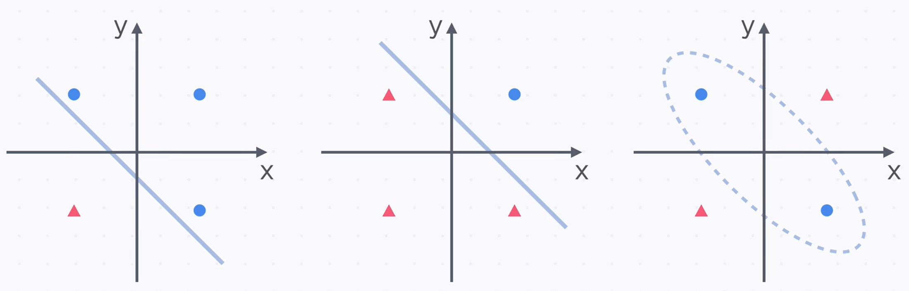
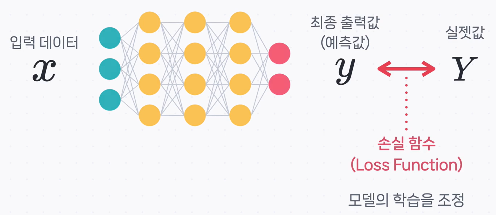

# 🧠 다층 퍼셉트론(MLP): 선을 넘어 곡선을 그리다

안녕하세요! 지난 시간에는 인공 신경망의 기본 단위인 '단층 퍼셉트론'에 대해 알아보았습니다. 단층 퍼셉트론은 이름처럼 하나의 층으로만 이루어져 있어, 데이터를 분류할 때 **'선형 경계'**, 즉 직선으로만 구분할 수 있다는 특징이 있었죠.

하지만 현실 세계의 데이터는 이렇게 단순한 직선 하나로 깔끔하게 나눌 수 없는 경우가 대부분입니다.

위 이미지처럼 직선(선형) 경계로는 도저히 동그라미와 세모를 제대로 나눌 수 없습니다. 이런 복잡한 데이터를 분류하려면 직선이 아닌, 유연한 곡선 형태의 **'비선형 경계'** 가 필요합니다. 이러한 단층 퍼셉트론의 한계를 극복하기 위해 등장한 것이 바로 **다층 퍼셉트론(Multi-Layer Perceptron, MLP)** 입니다.

---

## 은닉층의 등장: 더 깊고 똑똑해진 신경망

다층 퍼셉트론(MLP)과 단층 퍼셉트론의 가장 큰 차이점은 바로 **은닉층(Hidden Layer)** 의 존재입니다.

- **입력층 (Input Layer)**: 데이터를 받아들이는 첫 번째 관문입니다.
- **출력층 (Output Layer)**: 최종 결과를 내보내는 마지막 단계입니다.
- **은닉층 (Hidden Layer)**: 입력층과 출력층 사이에 위치하며, 이름처럼 겉으로 드러나지 않은 채 중요한 역할을 수행합니다. 입력 데이터 속의 복잡한 특징이나 패턴을 추출하고 학습하죠.

단층 퍼셉트론은 은닉층이 없는 구조이며, **MLP는 이 은닉층이 하나 이상 포함된 구조**를 말합니다. 필요에 따라 은닉층을 여러 개 깊게 쌓을 수 있는데, 이렇게 깊은 구조를 가진 신경망을 우리는 **심층 신경망(Deep Neural Network, DNN)** 이라고 부릅니다. 바로 여기서 '딥러닝'이라는 용어가 탄생했죠!

---

## 순전파: 입력에서 출력으로의 여정

그렇다면 MLP는 어떻게 입력 데이터를 가지고 최종 결과를 만들어낼까요? 이 과정을 **순전파(Forward Propagation)** 라고 합니다.

[Image illustrating the process of forward propagation]

순전파는 이름 그대로 데이터가 **'앞(順)으로 전파(傳播)'** 되는 과정입니다.

1.  데이터가 **입력층**으로 들어옵니다.
2.  입력된 데이터는 첫 번째 **은닉층**으로 전달됩니다. 각 노드는 가중합 연산을 거친 후, **활성화 함수**를 통해 다음 층으로 신호를 보냅니다.
3.  이 과정이 마지막 **은닉층**까지 반복됩니다.
4.  마지막 은닉층에서 나온 신호가 **출력층**으로 전달되어, 마침내 최종 예측값($y$)이 생성됩니다.

---

## MLP의 비밀 병기: 비선형 활성화 함수

"그런데, 단순히 층만 여러 개 쌓으면 어떻게 직선이 아닌 곡선 경계를 만들 수 있는 거죠?"

아주 좋은 질문입니다. 여기에 MLP의 가장 중요한 비밀이 숨어있습니다. 만약 각 층의 활성화 함수가 모두 선형 함수(직선)라면, 층을 아무리 많이 쌓아도 그 결과는 결국 하나의 큰 직선과 다를 바 없습니다.

따라서 MLP는 각 은닉층마다 **시그모이드(Sigmoid) 함수**와 같은 **비선형(Non-linear) 활성화 함수**를 사용합니다. 이 비선형 함수들이 각 층에서 신호를 적절히 '구부리고 비트는' 역할을 해주기 때문에, 전체 신경망은 복잡한 곡선 형태의 결정 경계를 만들어낼 수 있는 것입니다.

---

## 손실 함수: 정답과 얼마나 가까울까?

순전파를 통해 모델이 예측값($y$)을 내놓으면, 우리는 이 값이 실제 정답($Y$)과 얼마나 차이 나는지 확인해야 합니다. 이때 사용하는 것이 바로 **손실 함수(Loss Function)** 입니다.

[Image showing the comparison between prediction and actual value via loss function]

손실 함수는 **'예측이 얼마나 틀렸는지'** 를 나타내는 점수라고 할 수 있습니다. 이 손실(오차) 점수를 바탕으로, 신경망은 자신의 가중치를 수정하며 정답에 더 가까운 예측을 하도록 스스로를 개선해나갑니다. (이 과정은 '역전파'에서 더 자세히 다룹니다.)

---

## 핵심 요약

이번 시간에는 단층 퍼셉트론의 한계를 극복한 다층 퍼셉트론(MLP)에 대해 알아보았습니다.

> **다층 퍼셉트론(MLP)은 입력층과 출력층 사이에 하나 이상의 은닉층을 추가하고, 각 층에 비선형 활성화 함수를 사용하여 복잡한 비선형 데이터도 효과적으로 학습할 수 있는 신경망 모델입니다.**

- **한계 극복**: 단층 퍼셉트론의 **선형 경계** 문제를 **은닉층**을 추가하여 해결했습니다.
- **동작 방식**: 데이터는 **순전파**를 통해 입력층에서 출력층까지 순서대로 전달되어 예측값을 생성합니다.
- **핵심 요소**: **비선형 활성화 함수**를 사용해야만 복잡한 곡선 형태의 결정 경계를 만들 수 있습니다.
- **성능 평가**: **손실 함수**를 통해 모델의 예측값과 실제 정답의 차이를 계산하여 학습 방향을 조절합니다.
