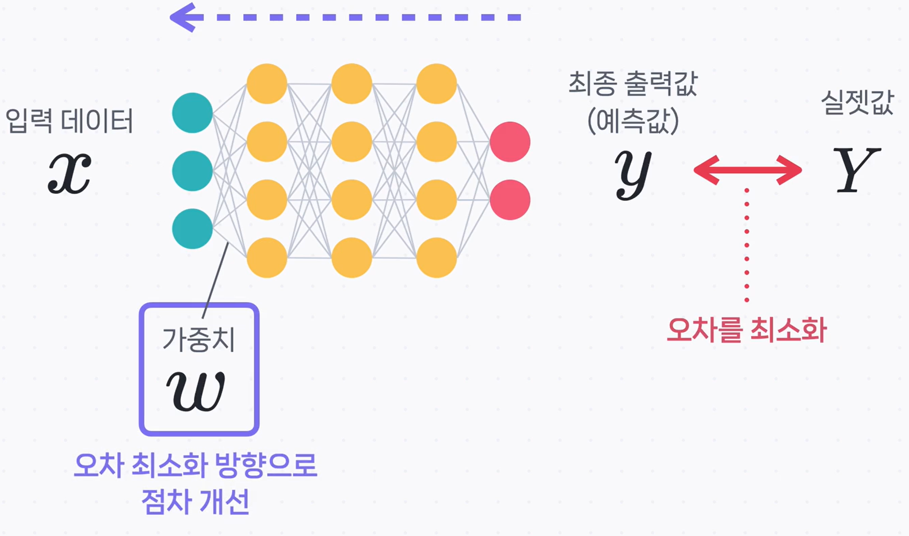
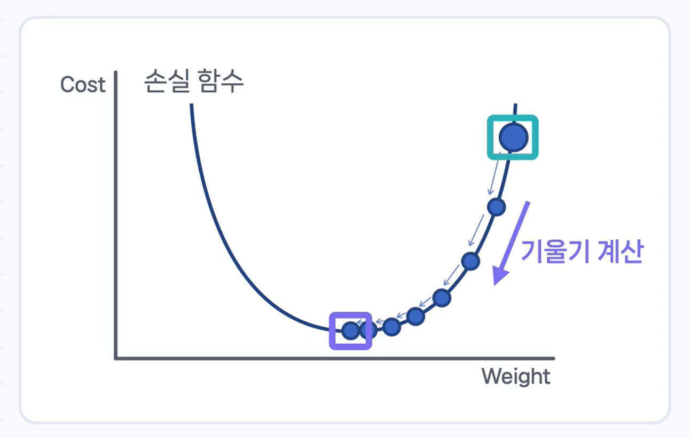

# 🧭 역전파와 경사 하강법: 모델이 스스로 학습하는 법

지난 문서에는 데이터가 입력층에서 출력층으로 흘러가며 예측값을 만들어내는 **순전파(Forward Propagation)** 과정에 대해 배웠습니다. 그리고 모델의 예측값이 실제 정답과 얼마나 다른지를 **손실 함수(Loss Function)** 로 계산했습니다.

그렇다면, **'딥러닝 모델이 학습을 잘한다'** 는 것은 무슨 의미일까요? 바로 이 **손실(오차)을 최소화**하는 것입니다.

하지만 모델은 처음부터 정답을 잘 맞히지 못합니다. 가중치가 무작위로 설정된 채 시작하기 때문에, 초기 예측값은 실제 정답과 큰 차이를 보일 수밖에 없죠. 여기서 모델이 스스로의 실수를 깨닫고 점점 더 똑똑해지게 만드는 핵심 과정, 바로 **역전파(Backpropagation)** 가 등장합니다.

---

## 역전파(Backpropagation): 오차의 원인을 거슬러 올라가다

**역전파**는 이름 그대로 **'역(逆)방향으로 오차를 전파(傳播)'** 하는 과정입니다.

쉽게 비유하자면, 팀 프로젝트에서 나쁜 결과(오차)가 나왔을 때, 그 원인이 누구에게 얼마나 있는지 마지막 단계부터 거슬러 올라가며 책임을 묻는 과정과 같습니다.

1.  먼저, 최종 출력층에서 발생한 오차(Loss)를 계산합니다.
2.  이 오차가 발생한 데에 바로 앞 은닉층의 어떤 노드가 얼마나 영향을 미쳤는지 계산합니다.
3.  그다음 층, 그다음 층으로 계속해서 오차의 원인을 거슬러 올라가며 각 **가중치($W$)** 가 오차에 얼마나 기여했는지(책임이 있는지)를 파악합니다.
4.  마지막으로, 책임이 큰 가중치는 더 많이, 책임이 적은 가중치는 더 적게 조절하여 모델 전체의 오차를 줄이는 방향으로 업데이트합니다.

이처럼 역전파는 '오차를 줄이려면 각 가중치를 어느 방향으로 얼마나 조절해야 하는지'에 대한 정보를 알려주는 핵심적인 과정입니다.

---

## 경사 하강법(Gradient Descent): 오차를 줄이는 가장 빠른 길

역전파를 통해 각 가중치를 '어떻게' 조절해야 할지 알았다면, 이제 실제로 가중치를 업데이트할 차례입니다. 이때 가장 널리 사용되는 방법이 바로 **경사 하강법(Gradient Descent)** 입니다.

경사 하강법은 **'산 정상에서 안개 때문에 길이 보이지 않을 때, 가장 가파른 경사를 따라 한 걸음씩 내려가다 보면 언젠가 가장 낮은 계곡에 도착한다'** 는 아이디어에 기반한 최적화 기법입니다.

- **손실 함수 그래프**: 우리가 내려가야 할 '산(또는 언덕)'
- **가중치(Weight)**: '나의 현재 위치'
- **손실 값(Cost)**: '나의 현재 높이'
- **기울기(Gradient)**: '현재 위치에서 가장 가파른 경사의 방향'

우리의 목표는 높이가 가장 낮은 지점, 즉 **손실이 최소가 되는 지점**을 찾는 것입니다. 그러기 위해서는 기울기가 가리키는 방향과 **정반대 방향**으로 나아가야 합니다.

---

## 가중치 업데이트: 똑똑해지기 위한 한 걸음

경사 하강법의 원리를 수식으로 표현하면 다음과 같습니다.

- Wnew : **업데이트된 새로운 가중치**. 이전보다 더 똑똑해진 값입니다.
- Wold : **이전 가중치**. 현재 값입니다.
- α : **학습률(Learning Rate)**. 산을 내려갈 때 내딛는 '보폭'의 크기를 의미합니다.
- Gradient : 손실 함수의 **기울기**. 역전파를 통해 계산된 '오차의 책임 정도'입니다.

즉, **'이전 가중치에서 기울기의 반대 방향으로 학습률만큼 이동하여 새로운 가중치를 만든다'** 는 의미입니다. 이 과정을 수없이 반복하며 점차 손실이 0에 가까운 최적의 가중치를 찾아가는 것이죠.

### ⚠️ 학습률(Learning Rate)의 중요성

여기서 학습률($α$)은 모델의 학습 속도와 성능에 지대한 영향을 미치는 중요한 변수입니다.

- **학습률이 너무 높으면**: 보폭이 너무 커서 최저점을 지나쳐 버리거나, 계곡 양쪽을 왔다 갔다 하며 오히려 손실 값이 **발산할 우려**가 있습니다.
- **학습률이 너무 낮으면**: 보폭이 너무 작아 학습 속도가 매우 느려지고, 전체를 보지 못해 넓고 깊은 진짜 최저점이 아닌 얕은 지역 최저점에 갇힐 수 있습니다.

따라서 문제에 맞는 적절한 학습률을 설정하는 것은 모델의 성능을 극대화하는 데 매우 중요합니다.

---

## 핵심 요약

이번 시간에는 딥러닝 모델의 핵심 학습 원리인 역전파와 경사 하강법에 대해 알아보았습니다.

> **딥러닝 모델은 순전파로 예측한 결과와 실제 정답의 차이(손실)를 계산하고, 이 손실에 대한 각 가중치의 책임 정도를 역전파를 통해 계산합니다. 그리고 경사 하강법을 이용해 손실이 줄어드는 방향으로 가중치를 업데이트하는 과정을 반복하며 스스로 학습합니다.**

- **역전파**: 출력층의 오차를 입력층 방향으로 전파하며, 각 가중치가 오차에 얼마나 기여했는지 계산하는 과정.
- **경사 하강법**: 손실 함수의 기울기 반대 방향으로 가중치를 이동시켜 손실을 최소화하는 최적화 알고리즘.
- **학습률**: 경사 하강법에서 가중치를 얼마나 업데이트할지 결정하는 '보폭'으로, 모델 성능에 큰 영향을 미침.

이 과정을 통해 딥러닝 모델은 주어진 데이터에 최적화된 예측을 할 수 있게 되며, 이것이 바로 다양한 분야에서 놀라운 성능을 발휘하는 비결입니다.
