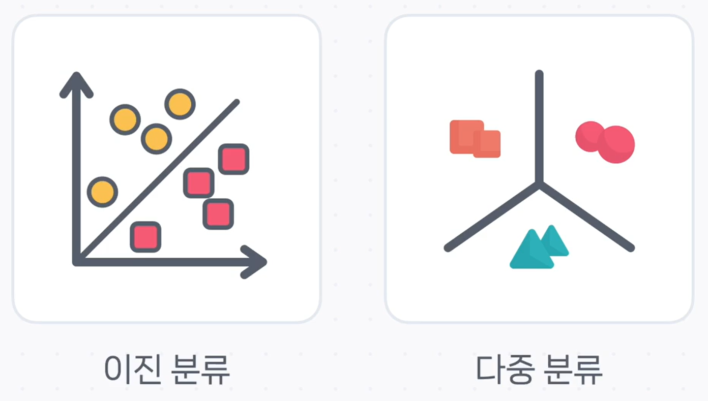

# 🎯 문제 유형에 맞는 출력 함수 선택 가이드

신경망이 열심히 계산을 마친 후, 우리는 그 결과를 한눈에 이해할 수 있는 형태로 받아보길 원합니다. 이때 신경망의 가장 마지막 단에서 최종 결과를 보기 좋게 다듬어주는 역할을 하는 것이 바로 **출력 함수(Output Function)** 입니다.

출력 함수는 신경망의 **출력층**에 위치하며, 모델이 해결하려는 문제의 종류, 특히 **회귀(Regression)** 와 **분류(Classification)** 에 따라 각기 다른 함수를 사용합니다. 지금부터 각 상황에 어떤 출력 함수를 선택해야 하는지 알아보겠습니다.

---

## 1. 회귀 (Regression): 숫자를 예측할 때

**회귀**는 주가, 온도, 집값처럼 **연속적인 숫자**를 예측하는 문제입니다.

회귀 문제에서는 신경망이 계산한 마지막 출력값을 별도의 가공 없이 그대로 사용하는 경우가 많습니다. 이는 기술적으로는 아무런 변환을 하지 않는 **항등 함수(Identity Function)** 를 활성화 함수로 사용하는 것과 같습니다.

$$y = Wx + b$$

모델이 계산한 값($y$)이 바로 예측값이 되며, 이 값은 특정 범위에 제한되지 않는 연속적인 실수입니다.

---

## 2. 분류 (Classification): 카테고리를 선택할 때

**분류**는 주어진 데이터가 어떤 카테고리(클래스)에 속하는지 맞추는 문제입니다. 분류는 다시 '둘 중 하나'를 고르는 **이진 분류**와 '여러 개 중 하나'를 고르는 **다중 분류**로 나뉩니다.

### ✅ 이진 분류 (Binary Classification) → 시그모이드 (Sigmoid)

**이진 분류**는 '스팸 메일 vs. 정상 메일', '합격 vs. 불합격'처럼 두 개의 선택지 중 하나를 고르는 문제입니다. 이때는 **시그모이드(Sigmoid) 함수**를 출력 함수로 사용합니다.

시그모이드 함수는 신경망의 최종 계산 결과($z = Wx + b$)를 **0과 1 사이의 확률 값으로 변환**해주는 역할을 합니다.

> **예시: 스팸 메일 분류**
>
> - 출력 노드는 1개입니다.
> - 시그모이드 함수를 통해 나온 출력값이 `0.76`이라면, 이는 "해당 메일이 스팸일 확률이 76%"라고 해석할 수 있습니다.
> - 일반적으로 확률이 **0.5**를 넘으면 해당 클래스(스팸)로 분류합니다.

### 🎨 다중 분류 (Multi-class Classification) → 소프트맥스 (Softmax)

**다중 분류**는 '고양이 vs. 개 vs. 새'처럼 세 개 이상의 선택지 중 하나를 고르는 문제입니다. 이때는 **소프트맥스(Softmax) 함수**를 사용합니다.

소프트맥스 함수는 모든 클래스에 대한 신경망의 최종 계산 결과들을 입력받아, **각 클래스에 속할 확률을 모두 계산**해줍니다. 소프트맥스의 가장 중요한 특징은 **모든 클래스의 확률을 더하면 항상 1이 된다**는 것입니다.

> **예시: 이미지 속 동물 분류 (고양이, 개, 새)**
>
> - 출력 노드는 클래스의 개수인 3개입니다.
> - 소프트맥스 함수를 통해 나온 출력값이 `고양이: 0.15`, `개: 0.05`, `새: 0.8`이라면, 이는 각 동물일 확률을 의미합니다.
> - 모델은 이 중 가장 확률이 높은 **'새'** 를 최종 예측 결과로 선택합니다.

---

## ✨ 핵심 요약

지금까지 문제 유형에 따라 어떤 출력 함수를 사용해야 하는지 알아보았습니다. 간단히 표로 정리하면 다음과 같습니다.

| 문제 유형     | 예측 대상                   | 출력 함수                   | 출력 값의 특징          |
| :------------ | :-------------------------- | :-------------------------- | :---------------------- |
| **회귀**      | 연속적인 숫자 (집값, 주가)  | **항등 함수** (그대로 출력) | 범위 제한 없는 실수     |
| **이진 분류** | 둘 중 하나 (스팸/정상)      | **시그모이드**              | 0~1 사이의 단일 확률 값 |
| **다중 분류** | 여러 개 중 하나 (동물 종류) | **소프트맥스**              | 총합이 1인 확률 분포    |

이처럼 딥러닝 모델은 해결하려는 문제에 가장 적합한 출력 함수를 선택함으로써, 복잡한 계산 결과를 우리가 이해하기 쉬운 최종 예측값으로 변환해 줍니다.
