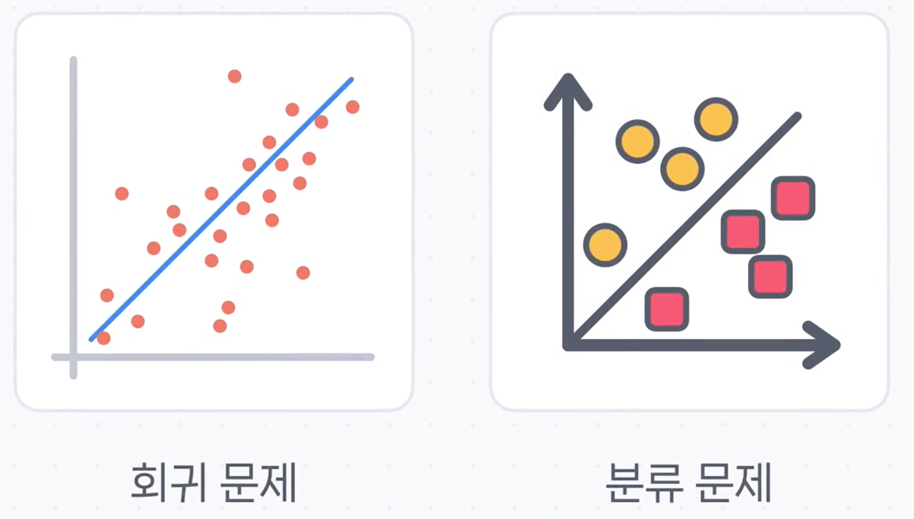
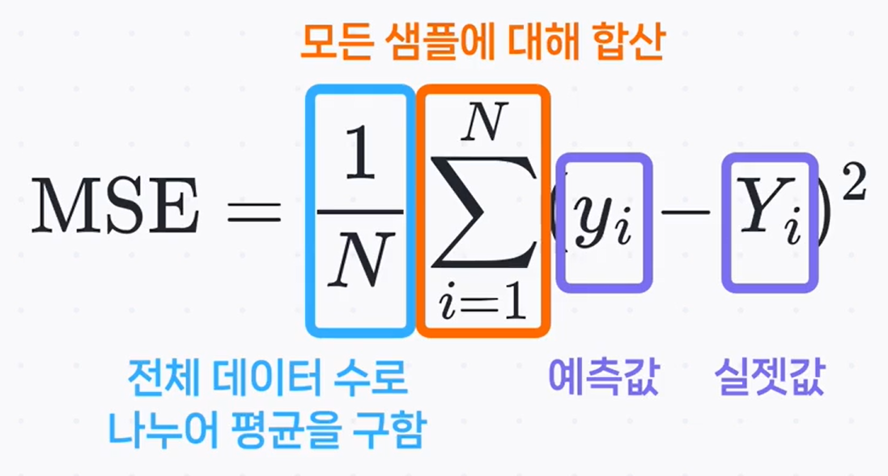
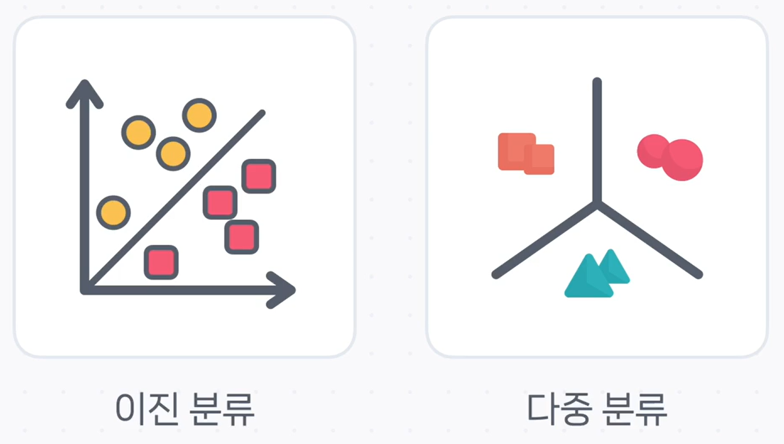
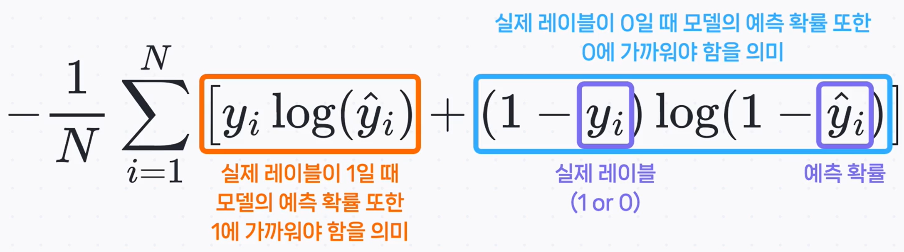
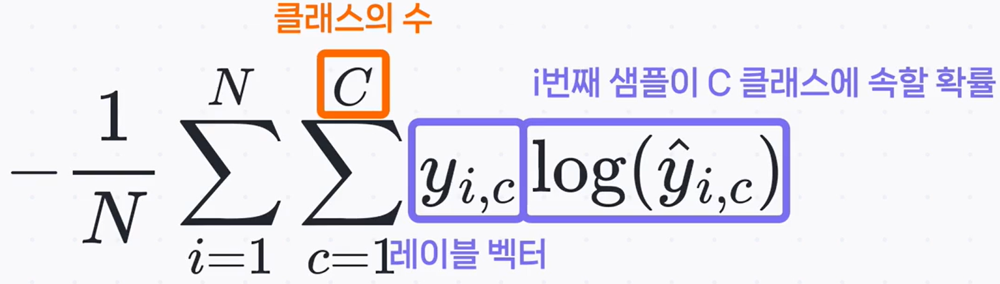

# 💯 모델의 성적표, 손실 함수 (Loss Function) 완벽 가이드

딥러닝 모델을 훈련시키는 것은 마치 학생을 가르치는 과정과 같습니다. 모델이 예측을 내놓으면, 우리는 그 예측이 얼마나 정답에 가까운지 '채점'을 해야 합니다. 이때 사용하는 채점 기준이 바로 **손실 함수(Loss Function)** 입니다.

**손실(Loss)** 이란 모델의 **예측값과 실제 정답 사이의 차이(오차)** 를 나타내는 점수입니다.

- **손실 값이 크다**: 모델이 정답과 거리가 먼 예측을 했다. (성적이 나쁘다 😥)
- **손실 값이 작다**: 모델이 정답에 가까운 예측을 했다. (성적이 좋다 😊)

따라서 **손실 함수 값을 가능한 한 작게 만드는 것**이 모든 딥러닝 모델 학습의 최종 목표라고 할 수 있습니다.

손실 함수는 풀어야 할 문제의 종류, 즉 **회귀** 문제와 **분류** 문제에 따라 다른 종류를 사용합니다.

---

## 1. 회귀 문제의 손실 함수: 평균 제곱 오차 (MSE)

**회귀(Regression)** 는 주가나 집값처럼 연속적인 숫자를 예측하는 문제입니다. 이때는 주로 **평균 제곱 오차(Mean Squared Error, MSE)** 를 손실 함수로 사용합니다.

MSE는 이름 그대로 **'오차를 제곱한 값의 평균'** 을 의미합니다.

1.  각 데이터에 대해 **예측값($y_i$)과 실제 정답($Y_i$)의 차이(오차)** 를 구합니다.
2.  이 오차($y_i$ - $Y_i$)들을 각각 **제곱**합니다.
3.  모든 데이터의 제곱 오차를 더한 후, 전체 데이터 개수($N$)로 나누어 **평균**을 냅니다.

> **💡 왜 오차를 제곱할까요?**
>
> 제곱을 하면 모든 오차 값이 양수가 될 뿐만 아니라, **오차가 클수록 손실 값이 기하급수적으로 커지는 효과**가 있습니다. 예를 들어, 오차가 2이면 제곱 오차는 4지만, 오차가 10이면 제곱 오차는 100이 되죠. 이는 모델에게 '큰 실수는 절대 하지 마!'라는 강력한 페널티를 부여하여, 예측이 터무니없이 벗어나는 것을 막아줍니다.

---

## 2. 분류 문제의 손실 함수: 교차 엔트로피 (Cross-Entropy)

**분류(Classification)** 는 주어진 데이터가 어떤 카테고리에 속하는지 맞추는 문제입니다. 이때는 주로 **교차 엔트로피(Cross-Entropy)** 계열의 손실 함수를 사용합니다.

교차 엔트로피는 모델이 예측한 **'확률'** 이 실제 정답의 **'확률 분포'** 와 얼마나 다른지를 측정합니다. 특히, **'틀린 답에 대해 얼마나 확신했는가'** 를 중요한 채점 기준으로 삼아, 어설픈 예측보다 확신에 차서 틀리는 예측에 더 큰 페널티를 부여합니다.

### ✅ 이진 분류 → 이진 교차 엔트로피 (Binary Cross-Entropy)

**이진 분류**는 '스팸 vs. 정상'처럼 둘 중 하나를 맞추는 문제입니다.

위 수식은 복잡해 보이지만, 실제로는 두 가지 상황만 고려하면 간단합니다.

- **정답이 1일 때 ($y_i=1$)**: 수식의 두 번째 항 `(1-1)log(...)`이 0이 되어 사라집니다. 모델이 예측한 확률($\hat{y_i}$)이 1에 가까워질수록 **log($\hat{y_i}$)** 값이 0에 가까워져 손실이 작아집니다.
- **정답이 0일 때 ($y_i=0$)**: 수식의 첫 번째 항 `0 * log(...)`이 0이 되어 사라집니다. 모델이 예측한 확률($\hat{y_i}$)이 0에 가까워질수록 **log(1-$\hat{y_i}$)** 값이 0에 가까워져 손실이 작아집니다.

즉, 정답에 해당하는 확률 예측값은 높이고, 오답에 해당하는 확률 예측값은 낮추도록 모델을 학습시킵니다.

### 🎨 다중 분류 → 교차 엔트로피 (Cross-Entropy)

**다중 분류**는 '고양이 vs. 개 vs. 새'처럼 여러 개 중 하나를 맞추는 문제입니다.

이 함수는 모델이 내놓은 **'모든 클래스에 대한 확률 분포'** 를 정답과 비교합니다. 여기서 $y_{i,c}$는 **원-핫 인코딩(One-Hot Encoding)** 된 실제 정답 벡터를 의미합니다.

> **예시: [고양이, 개, 새] 분류 문제**
>
> - **실제 정답**: '새' (원-핫 인코딩: `[0, 0, 1]`)
> - **모델 예측**: `[고양이: 0.1, 개: 0.1, 새: 0.8]`
>
> 교차 엔트로피는 원-핫 인코딩된 정답 레이블을 사용하여, **오직 정답 클래스('새')의 예측 확률(0.8)에만 집중**하여 손실을 계산합니다. (`0*log(0.1)`, `0*log(0.1)` 항은 사라짐) 모델이 정답 클래스에 대해 더 높은 확률(1에 가까운 값)을 예측할수록 손실은 줄어듭니다.

---

## ✨ 핵심 요약

모델의 성적표인 손실 함수는 문제 유형에 따라 올바르게 선택해야 합니다.

| 문제 유형                    | 주요 손실 함수               | 핵심 아이디어                                    |
| :--------------------------- | :--------------------------- | :----------------------------------------------- |
| **회귀** (숫자 예측)         | **평균 제곱 오차 (MSE)**     | 오차의 제곱에 비례하여 페널티 부여               |
| **이진 분류** (둘 중 하나)   | **이진 교차 엔트로TP (BCE)** | 정답/오답 확률을 모두 고려하여 손실 계산         |
| **다중 분류** (여럿 중 하나) | **교차 엔트로피 (CCE)**      | 정답 클래스의 확률을 얼마나 높게 예측했는지 평가 |

올바른 손실 함수를 선택하는 것은 모델이 올바른 방향으로 똑똑하게 학습하기 위한 가장 중요한 첫걸음입니다.
