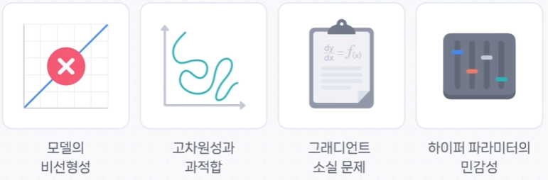
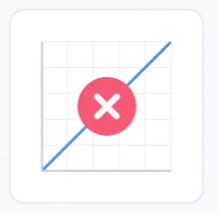
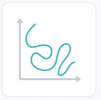
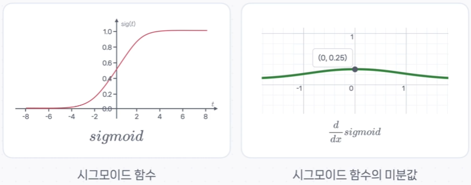

# ⛰️ 딥러닝 최적화, 왜 이렇게 어려울까? (4가지 난관)

딥러닝 모델을 '잘' 학습시키는 최적화 과정은 결코 쉽지 않은 과정입니다. 마치 험난한 산을 오르는 등반과도 같죠.

이번 시간에는 딥러닝 모델의 최적화를 어렵게 만드는 대표적인 네 가지 난관에 대해 알아보겠습니다.

---

## 1. 모델의 비선형성: 울퉁불퉁한 손실 함수의 표면

첫 번째 난관은 딥러닝 모델이 가진 **'비선형성(Non-linearity)'** 입니다.

딥러닝은 **비선형 활성화 함수**를 사용하여 복잡한 패턴을 학습할 수 있는 강력한 표현력을 얻었습니다. 하지만 이 덕분에 우리가 최소화해야 할 손실 함수(Loss Function)의 표면이 단순한 그릇 모양이 아닌, 수많은 언덕과 계곡이 있는 **울퉁불퉁한 산맥**처럼 변해버립니다.

> **단순한 문제**: 움푹 파인 그릇(**전역 최솟값**)의 가장 낮은 지점을 찾기만 하면 됩니다.
> **딥러NING 문제**: 수많은 계곡(**지역 최솟값, Local Minimum**) 중에서 가장 깊은 진짜 계곡(**전역 최솟값, Global Minimum**)을 찾아야 하는 어려운 상황에 놓이게 됩니다.

---

## 2. 고차원성과 과적합: 똑똑하지만 융통성 없는 암기왕

두 번째 난관은 모델의 **'고차원성'** 과 그로 인한 **'과적합(Overfitting)'** 의 위험입니다.

최신 딥러닝 모델은 수백만 개, 심지어 수십억 개의 학습 가능한 **파라미터(가중치와 편향)** 를 가지고 있습니다. 이렇게 파라미터가 많으면 매우 복잡한 패턴도 학습할 수 있지만, 자칫하면 융통성 없는 '암기왕'이 될 수 있습니다.

**과적합**이란, 모델이 훈련 데이터의 정답을 통째로 외워버려서, 시험(훈련 데이터)은 100점을 받지만 조금만 다른 새로운 문제(테스트 데이터)는 전혀 풀지 못하는 현상을 말합니다. 훈련 데이터에 비해 모델의 파라미터가 지나치게 많을 때 주로 발생하죠.

> 💡 이를 방지하기 위해 **데이터 증강(Data Augmentation)**, **드롭아웃(Dropout)**, **정규화(Regularization)** 와 같은 다양한 규제 기법들이 사용됩니다. (이 기법들은 나중에 자세히 다룰 예정입니다.)

---

## 3. 기울기 소실 문제: 희미해지는 학습 신호

세 번째 난관은 네트워크가 깊어질수록 발생하는 **'기울기 소실(Gradient Vanishing)'** 문제입니다.

이는 마치 '고요 속의 외침' 게임과 같습니다. 맨 뒷사람(출력층)이 외친 오차 신호가 여러 사람(은닉층)을 거쳐 맨 앞사람(입력층)에게 전달될 때, 목소리가 점점 작아져서 결국 들리지 않게 되는 현상이죠.

이 문제의 주된 원인 중 하나는 **시그모이드(Sigmoid)** 와 같은 활성화 함수입니다.

- 위 이미지를 보면, 시그모이드 함수의 미분값(기울기)은 최대가 **0.25**이고 양 끝으로 갈수록 0에 가까워집니다.
- 역전파 과정에서 이 1보다 작은 기울기 값들이 여러 층을 거치며 계속 곱해지면, 기울기는 거의 0에 가깝게 사라져 버립니다.
- 결국, 앞쪽 층의 가중치들은 자신이 무엇을 고쳐야 할지 신호를 받지 못해 학습이 멈추게 됩니다.

> 💡 이 문제를 해결하기 위해 **ReLU**와 같이 기울기 소실에 강한 활성화 함수를 사용하거나, **배치 정규화(Batch Normalization)**, 적절한 **가중치 초기화** 등의 기법이 사용됩니다.

---

## 4. 하이퍼파라미터의 민감성: 최고의 레시피 찾기

네 번째 난관은 **'하이퍼파라미터(Hyperparameter)의 민감성'** 입니다.

하이퍼파라미터는 셰프가 요리를 시작하기 전에 정하는 '레시피'와 같습니다. **학습률, 배치 크기, 은닉층의 수, 옵티마이저 종류** 등이 여기에 해당하죠.

최고의 요리(모델 성능)를 만들기 위해서는 이 레시피의 조합을 잘 찾아야 하는데, 정답이 정해져 있지 않습니다. 미세한 조정만으로도 모델의 성능이 크게 달라지기 때문에, 수많은 실험과 시행착오를 통해 최적의 값을 찾아나가는 과정이 필수적입니다.

---

## ✨ 핵심 요약

딥러닝 모델의 최적화가 어려운 이유는 다음과 같은 복합적인 문제들 때문입니다.

> **딥러NING 최적화는 비선형적인 모델 구조로 인해 복잡해진 손실 함수 위에서, 과적합이나 기울기 소실 같은 함정을 피해 가며, 민감한 하이퍼파라미터들을 정교하게 조율해야 하는 매우 도전적인 과제입니다.**

- **모델의 비선형성**: 수많은 가짜 정답(지역 최솟값) 속에서 진짜 정답(전역 최솟값)을 찾아야 함.
- **고차원성과 과적합**: 모델이 학습 데이터를 암기하지 않고 일반화된 패턴을 배우도록 이끌어야 함.
- **기울기 소실**: 깊은 신경망의 모든 층이 균형 있게 학습되도록 신호를 잘 전달해야 함.
- **하이퍼파라미터 민감성**: 최적의 성능을 내는 '레시피' 조합을 찾아야 함.

이러한 난관들을 이해하고 효과적으로 대처하는 것이 성공적인 딥러닝 모델을 만드는 핵심 역량이라고 할 수 있습니다.
