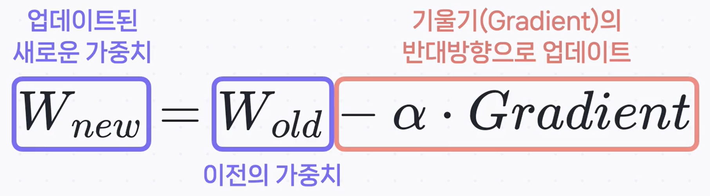

# ⚙️ 딥러닝 모델 성능을 좌우하는 4가지 하이퍼파라미터

안녕하세요! 딥러닝 모델을 만드는 것은 마치 성능 좋은 자동차를 만드는 것과 같습니다. 엔진(모델 구조)을 만들었다면, 이제 최상의 성능을 내도록 세밀하게 튜닝할 차례죠. 이때 우리가 조절하는 여러 설정값을 **하이퍼파라미터(Hyperparameter)** 라고 합니다.

하이퍼파라미터는 모델이 **학습을 시작하기 전에 사용자가 직접 설정하는 값**으로, 모델의 학습 속도, 안정성, 그리고 최종 성능에 결정적인 영향을 미칩니다. 이번 시간에는 가장 중요하고 기본적인 네 가지 하이퍼파라미터에 대해 알아보겠습니다.

---

## 1. 배치 크기 (Batch Size): 한 번에 얼마나 공부할까?

**배치 크기**는 모델이 한 번에 학습할 **데이터 샘플의 개수** 를 의미합니다. 전체 문제집(데이터셋)을 한 문제씩 풀지, 아니면 한 챕터씩 풀지를 정하는 것과 같습니다.

- **배치 크기가 작을 때 (e.g., 32)**

  - **장점**: 적은 메모리로도 학습이 가능하고, 가중치 업데이트가 자주 일어나므로 학습 속도가 빠를 수 있습니다.
  - **단점**: 한 번에 보는 데이터가 적어 학습 과정이 불안정하고, 전체 데이터의 경향을 제대로 파악하기 어려울 수 있습니다. (성적이 들쑥날쑥할 수 있음)

- **배치 크기가 클 때 (e.g., 256)**
  - **장점**: 전체 데이터의 경향을 더 잘 반영하여 안정적으로 학습합니다.
  - **단점**: 많은 메모리가 필요하며, 한 번 업데이트하는 데 시간이 오래 걸립니다. 때로는 너무 안정적인 나머지 다양한 탐색을 하지 못해 오히려 성능이 떨어지는 경우도 있습니다.

---

## 2. 학습률 (Learning Rate): 어떤 보폭으로 내려갈까?

**학습률**은 손실 함수의 최저점을 찾아가는 과정에서 **'얼마나 큰 보폭으로 움직일지'** 를 결정하는 값입니다.

$$
W_{new} = W_{old} - \alpha \cdot \text{Gradient}
$$

위 경사 하강법 수식에서 $\alpha$(알파)가 바로 학습률입니다. 역전파를 통해 계산된 기울기(Gradient) 방향으로 얼마나 나아갈지를 결정하죠.

- **학습률이 너무 낮으면**: 보폭이 너무 작아 최저점까지 가는 데 시간이 매우 오래 걸리거나, 중간에 학습이 멈춰 버릴 수 있습니다.
- **학습률이 너무 높으면**: 보폭이 너무 커서 최저점을 휙 지나쳐 버리거나, 계곡의 양쪽을 왔다 갔다 하며 오히려 손실이 커지는 **발산** 현상이 발생할 수 있습니다.

---

## 3. 에폭 수 (Epoch): 교과서를 몇 번 정독할까?

**에폭**은 **전체 훈련 데이터셋을 총 몇 번 반복해서 학습할지**를 의미합니다. 교과서 전체를 처음부터 끝까지 한 번 다 읽는 것을 '1 에폭'이라고 생각할 수 있습니다.

- **에폭 수가 너무 적으면**: 모델이 데이터의 패턴을 충분히 학습하지 못해 성능이 낮아집니다. (교과서를 한두 번만 봐서는 내용을 다 알 수 없는 것과 같음)
- **에폭 수가 너무 많으면**: 모델이 훈련 데이터의 모든 것을 암기해버리는 **과적합(Overfitting)** 이 발생할 수 있습니다. 이 경우, 시험(훈련 데이터)은 100점이지만 새로운 문제(테스트 데이터)는 풀지 못하게 됩니다.

### 💡 배치 크기 vs. 에폭, 다시 한번 정리!

두 개념은 종종 헷갈리지만 명확히 다릅니다.

> 전체 문제집에 2,000문제가 있고, 배치 크기를 100으로 설정했다면?
>
> - **1 스텝(Step/Iteration)**: 100문제를 한 번 푸는 것.
> - **1 에폭(Epoch)**: 2,000문제를 모두 푸는 것. 즉, 20번의 스텝(2000 / 100)을 거치면 1 에폭이 완료됩니다.

---

## 4. 옵티마이저 (Optimizer): 어떤 방식으로 길을 찾을까?

**옵티마이저(최적화 알고리즘)** 는 손실 함수라는 거대한 산맥에서 가장 낮은 계곡을 찾아 내려가기 위한 **'등반 전략' 또는 '내비게이션'** 입니다.

단순히 가장 가파른 경사로만 내려가는 기본적인 **SGD(확률적 경사 하강법)** 부터, 관성을 이용해 더 빠르고 안정적으로 내려가는 **모멘텀(Momentum)**, 그리고 각 파라미터마다 보폭(학습률)을 조절하며 효율적으로 움직이는 **아담(Adam)** 까지 다양한 전략이 있습니다.

어떤 옵티마이저가 항상 최고라고 말할 수는 없으며, 문제와 데이터에 따라 가장 효과적인 전략이 다르므로 여러 옵티마이저를 실험해보는 것이 좋습니다.

---

## ✨ 핵심 요약

딥러닝 모델의 성공적인 학습을 위해서는 하이퍼파라미터를 신중하게 설정하고 조율하는 과정이 필수적입니다.

| 하이퍼파라미터 | 역할 비유           | 핵심 기능                                   |
| :------------- | :------------------ | :------------------------------------------ |
| **배치 크기**  | 한 번에 공부할 분량 | 가중치 업데이트 주기와 안정성 조절          |
| **학습률**     | 학습 보폭 크기      | 모델의 수렴 속도와 안정성 조절              |
| **에폭 수**    | 교과서 정독 횟수    | 전체 데이터셋에 대한 반복 학습 횟수 조절    |
| **옵티마이저** | 최저점 탐색 전략    | 손실을 최소화하는 가중치 업데이트 방식 결정 |

이 파라미터들을 잘 관리하고 조정함으로써, 모델은 주어진 데이터로부터 최대의 학습 효과를 얻고 최상의 성능을 발휘할 수 있게 됩니다.
