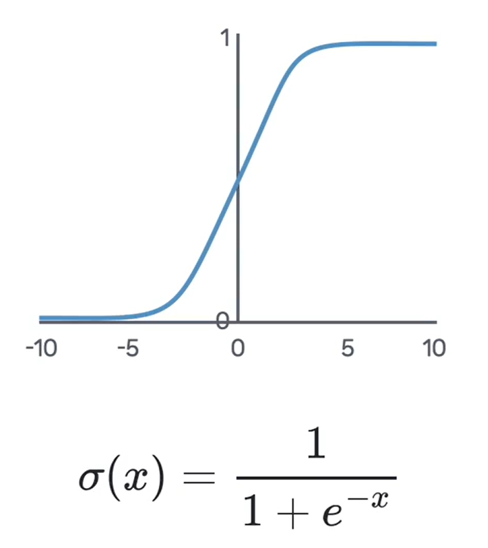
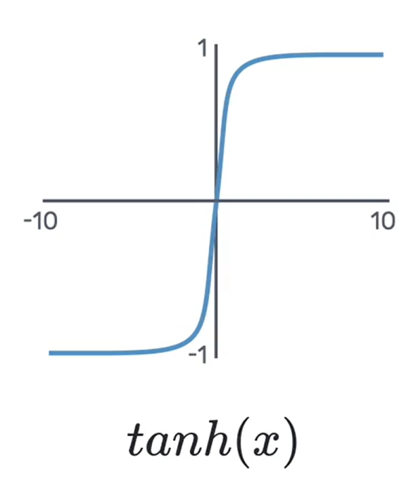
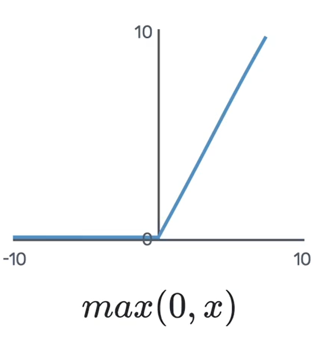

# 🧠 신경망에 생명을 불어넣는 활성화 함수 (Activation Function)

안녕하세요! 이번 시간에는 신경망의 성능과 개성을 결정하는 매우 중요한 요소인 **활성화 함수(Activation Function)** 에 대해 알아보겠습니다.

## 활성화 함수 (Activation Function)란 무엇일까요?

**활성화 함수**는 뉴런에 들어온 신호의 총합을 그대로 내보낼지, 아니면 특정 규칙에 따라 변환해서 내보낼지를 결정하는 **'신호 조절기' 또는 '게이트키퍼'** 입니다.

$$
y = f\left(\sum_{i=1}^{n} W_i x_i + b\right)
$$

위 수식에서 $f$가 바로 활성화 함수입니다. 가중합 연산을 거친 값을 입력받아, 최종 출력 신호 $y$로 변환하는 역할을 하죠.

> **💡 왜 비선형(Non-linear) 함수를 사용할까요?**
>
> 만약 활성화 함수가 없다면(또는 선형 함수라면), 신경망을 아무리 깊게 쌓아도 그 결과는 결국 하나의 거대한 선형 함수와 다를 바 없습니다. **비선형 활성화 함수**를 각 층에 도입함으로써, 신경망은 직선의 한계를 넘어 복잡하고 구불구불한 데이터 패턴까지 학습할 수 있는 강력한 표현력을 갖추게 됩니다.

어떤 활성화 함수를 선택하는지에 따라 모델의 학습 능력과 성능이 크게 달라지기 때문에, 다양한 함수의 특징을 이해하고 상황에 맞게 사용하는 것이 중요합니다.

---

## 대표적인 활성화 함수들

### 1. 시그모이드 함수 (Sigmoid Function)

초기 신경망 연구에서 널리 사용되었던 활성화 함수입니다. 어떤 입력 값이든 **0과 1 사이의 값으로 변환**해주어, 확률을 나타내는 데 유용하게 쓰였습니다.

- **한계**:
  - **기울기 소실(Vanishing Gradient)**: 함수의 양 끝으로 갈수록 기울기가 0에 가까워집니다. 이 때문에 신경망이 깊어질수록 앞쪽 층까지 기울기가 제대로 전달되지 않아 학습이 멈추는 문제가 발생합니다.
  - **Zero-centered가 아님**: 출력값의 중심이 0이 아니어서 학습 과정이 다소 비효율적으로 진행될 수 있습니다.

### 2. Tanh 함수 (Hyperbolic Tangent)

Tanh 함수는 시그모이드 함수를 개선한 버전입니다. 출력 범위를 **-1과 1 사이**로 확장하여, 출력값의 중심이 0이 되도록 만들었습니다.

- **장점**: 출력값의 중심이 0이므로, 시그모이드에 비해 학습 초기 수렴 속도가 더 빠른 경향이 있습니다.
- **한계**: 여전히 양 끝에서 기울기가 0에 가까워지기 때문에, **기울기 소실 문제**는 해결하지 못했습니다.

### 3. ReLU 함수 (Rectified Linear Unit)

**ReLU(렐루)** 는 현대 딥러닝에서 **가장 널리 사용되는** 인기 있는 활성화 함수입니다. 그 이유는 단순함과 강력함에 있습니다.

- **동작 방식**: 입력이 **0보다 크면 그대로** 출력하고, **0보다 작으면 0**을 출력합니다. `max(0, x)`
- **장점**:
  - 입력이 양수일 때는 기울기가 항상 1이므로, **기울기 소실 문제를 해결**했습니다.
  - 연산이 매우 단순하여 계산 속도가 빠릅니다.
- **한계**:
  - **죽은 뉴런(Dying ReLU) 문제**: 입력이 음수이면 기울기가 0이 되어, 해당 뉴런은 더 이상 학습 과정에서 가중치를 업데이트하지 못하고 '죽어버리는' 현상이 발생할 수 있습니다.

### 4. Leaky ReLU 함수

Leaky ReLU는 ReLU의 '죽은 뉴런' 문제를 해결하기 위해 등장한 변형 함수입니다.

- **동작 방식**: 입력이 양수일 때는 ReLU와 동일하지만, **음수일 때 0이 아닌 아주 작은 기울기(e.g., 0.01)를 부여**합니다. `max(0.01x, x)`
- **장점**: 음수 입력에 대해서도 미세한 기울기를 유지함으로써, 뉴런이 완전히 죽는 것을 방지하고 학습을 계속 이어나갈 수 있도록 돕습니다.

---

## ✨ 핵심 요약

신경망을 설계할 때는 각 활성화 함수의 특징을 이해하고 문제에 가장 적합한 함수를 선택하는 것이 중요합니다.

| 활성화 함수    | 출력 범위 | 기울기 소실 문제     | 죽은 뉴런 문제 | 주요 특징                           |
| :------------- | :-------- | :------------------- | :------------- | :---------------------------------- |
| **Sigmoid**    | (0, 1)    | 있음                 | 없음           | 초기 모델, 이진 분류 출력층에 사용  |
| **Tanh**       | (-1, 1)   | 있음                 | 없음           | Sigmoid의 Zero-centered 개선 버전   |
| **ReLU**       | [0, ∞)    | **해결 (양수 구간)** | **있음**       | **현대 모델의 기본값, 계산 효율성** |
| **Leaky ReLU** | (-∞, ∞)   | **해결**             | **개선**       | ReLU의 '죽은 뉴런' 문제 보완        |

최근에는 대부분의 은닉층에 **ReLU** 또는 **Leaky ReLU**를 기본적으로 사용하며, 이를 통해 더 깊고 효율적인 신경망을 성공적으로 학습시키고 있습니다.
