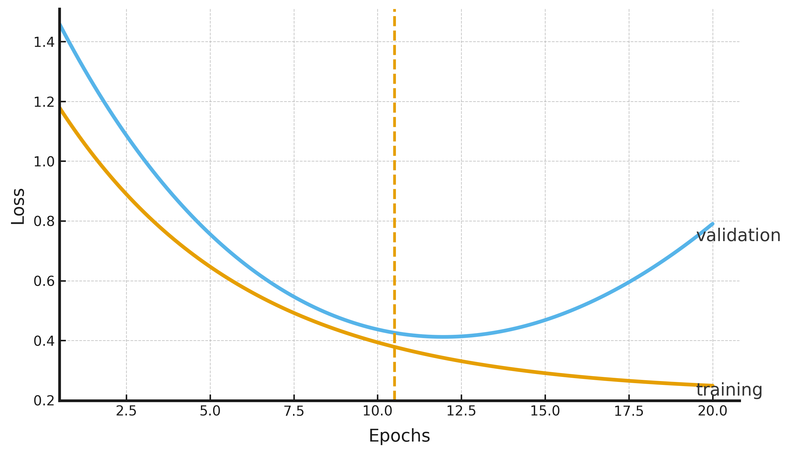

# 🧠 모델을 똑똑하게 단련시키는 규제(Regularization) 기법

안녕하세요! 딥러닝 모델을 훈련시킬 때 가장 주의해야 할 적 중 하나는 바로 **'과적합(Overfitting)'** 입니다. 이번 시간에는 이 과적합을 방지하고 모델의 실전 능력을 키워주는 다양한 **규제(Regularization)** 기법에 대해 알아보겠습니다.

## 규제(Regularization)란?

### 정의

**규제**는 모델이 훈련 데이터에만 너무 익숙해지는 **과적합 현상을 방지**하고, 처음 보는 데이터에 대해서도 좋은 성능을 내도록 **일반화 성능을 향상**시키기 위한 모든 기법을 의미합니다.

### 비유와 설명

> **비유: 족집게 과외 vs. 원리 이해 👨‍🏫**
>
> - **과적합된 모델**: 연습 문제(훈련 데이터)의 답만 통째로 외운 학생과 같습니다. 연습 문제는 100점을 받지만, 조금만 응용된 실전 시험(테스트 데이터)에서는 형편없는 점수를 받습니다.
> - **규제가 적용된 모델**: 답을 외우기보다 문제의 원리를 이해하려고 노력하는 학생과 같습니다. 연습 문제 점수는 100점이 아닐 수 있지만, 어떤 문제가 나와도 잘 풀어내는 실전 능력이 뛰어납니다.

규제는 모델에 일종의 '제약'을 걸어, 훈련 데이터의 너무 세세한 부분까지 암기하는 것을 방해하고 데이터 전체를 관통하는 더 큰 패턴을 학습하도록 유도합니다.

---

## 대표적인 규제 기법들

### 1. L1 / L2 규제 (가중치에 페널티 부여하기)

L1과 L2 규제는 손실 함수에 **'가중치가 너무 커지지 않도록'** 벌점(penalty)을 주는 항을 추가하는 방식입니다.

#### L1 규제 (Lasso)

**정의**: 손실 함수에 모든 **가중치의 절댓값의 합**에 비례하는 페널티를 추가합니다.

$$\text{손실 함수} + \lambda \sum_{j=1}^{M} |w_j|$$

- **$\text{손실 함수}$**: 모델의 예측 오차를 나타내는 기존의 손실 함수입니다.
- **$\lambda$ (람다)**: 규제의 강도를 조절하는 하이퍼파라미터입니다. 값이 클수록 더 강한 규제가 적용됩니다.
- **$w_j$**: 모델의 각 가중치(weight)를 의미합니다.

> **비유: 불필요한 지출은 0으로 만드는 예산 관리 💰**
>
> L1 규제는 덜 중요한 특징(feature)에 연결된 가중치를 아예 0으로 만들어 버리는 경향이 있습니다. 이는 모델에서 **불필요한 특징을 자동으로 골라내는(feature selection)** 효과를 줍니다.

#### L2 규제 (Ridge)

**정의**: 손실 함수에 모든 **가중치의 제곱의 합**에 비례하는 페널티를 추가합니다.

$$\text{손실 함수} + \lambda \sum_{j=1}^{M} {w_j}^2$$

> **비유: 모든 지출을 골고루 줄이는 예산 관리 💸**
>
> L2 규제는 가중치를 0으로 만들기보다는, 전반적으로 **모든 가중치의 크기를 작게 유지**하도록 만듭니다. 이는 특정 가중치가 너무 큰 영향력을 갖지 않도록 하여, 모델을 더 안정적으로 만들어주는 효과가 있습니다. **일반적으로 L1보다 더 널리 사용됩니다.**

### 2. 드롭아웃 (Dropout)

### 정의

**드롭아웃**은 훈련 과정에서 각 단계마다 신경망의 일부 뉴런을 **무작위로 비활성화**시키는 기법입니다.

### 비유와 설명

> **비유: 팀 프로젝트의 무작위 결석 👨‍💻**
>
> 매일 팀원 중 몇 명이 무작위로 결석한다고 상상해 보세요. 특정 에이스 팀원에게만 의존할 수 없게 되므로, 모든 팀원이 각자 자기 역할을 더 확실히 해내야 프로젝트가 완성될 겁니다.
>
> 드롭아웃은 이처럼 모델이 특정 뉴런의 조합에 과도하게 의존하는 것을 막고, 각 뉴런이 독립적으로 더 robust한 특징을 학습하도록 강제하여 결과적으로 전체 모델의 일반화 성능을 높입니다.

### 3. 조기 종료 (Early Stopping)

### 정의

**조기 종료**는 검증 세트(Validation Set)의 성능이 더 이상 개선되지 않을 때 **훈련을 일찍 멈추는** 기법입니다.

### 비유와 설명

> **비유: 밤샘 공부의 한계 🥱**
>
> 시험공부를 할 때, 밤을 새울수록 오히려 집중력이 떨어져 성적이 더 나빠지는 지점이 있습니다. 조기 종료는 검증 세트의 점수(성능)가 최고점을 찍고 떨어지기 시작하는 바로 그 지점에서 공부(훈련)를 멈추고 잠자리에 드는 것과 같습니다. 이는 불필요한 훈련으로 인한 과적합을 막는 가장 간단하고 효과적인 방법 중 하나입니다.

### 4. 데이터 증강 (Data Augmentation)

### 정의

**데이터 증강**은 가지고 있는 원본 데이터에 여러 변형을 가하여 **훈련 데이터의 양을 인위적으로 늘리는** 기법입니다.

### 비유와 설명

> **비유: 다양한 각도의 고양이 사진 보여주기 🐈**
>
> 아이에게 '고양이'를 가르칠 때, 정면 사진 한 장만 보여주는 것보다 옆모습, 뒷모습, 누워있는 모습 등 다양한 사진을 보여주는 것이 효과적입니다.
>
> 데이터 증강은 원본 이미지를 회전, 확대/축소, 좌우 반전시키는 등의 변형을 통해 모델이 **다양한 변화에도 흔들리지 않는 본질적인 특징**을 학습하도록 돕습니다.

---

## ✨ 핵심 요약

과적합을 막고 모델의 실전 능력을 키우는 규제 기법은 다양하며, 문제와 상황에 맞게 적절히 사용하는 것이 중요합니다.

| 규제 기법        | 핵심 전략                                          |
| :--------------- | :------------------------------------------------- |
| **L1 / L2 규제** | 가중치의 크기가 너무 커지지 않도록 페널티를 부여   |
| **드롭아웃**     | 훈련 중 일부 뉴런을 무작위로 꺼서 과도한 의존 방지 |
| **조기 종료**    | 검증 성능이 최고일 때 훈련을 멈춰 과적합 방지      |
| **데이터 증강**  | 데이터에 변형을 주어 양을 늘리고 일반화 성능 향상  |
