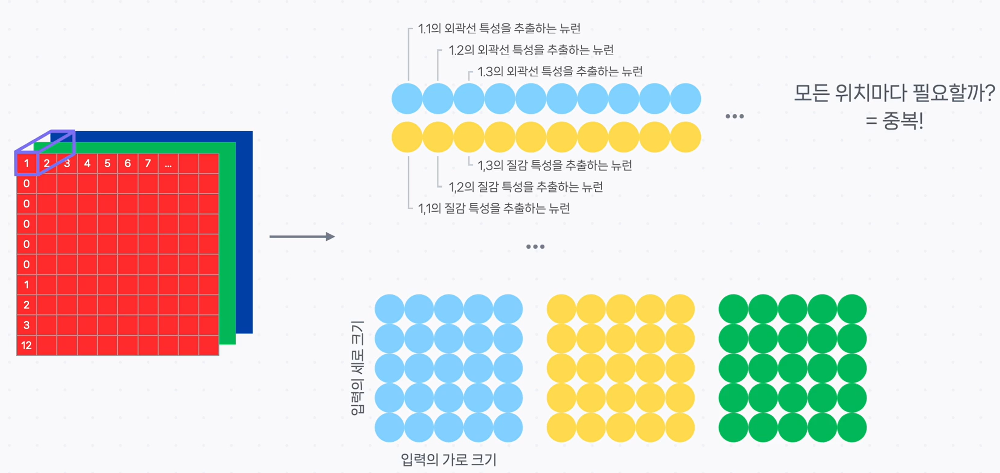

# 🖼️ 이미지를 이해하는 눈, CNN (Convolutional Neural Network)의 기본 원리

지난 시간에는 기본 신경망(FCN)이 이미지와 같은 고차원 데이터를 다루기 어렵다는 한계에 대해 알아보았습니다. 이번 시간에는 이 문제를 해결하고 컴퓨터 비전(Computer Vision) 분야에 혁신을 가져온 **CNN(Convolutional Neural Network)** 의 핵심 원리에 대해 알아보겠습니다.

## 컴퓨터는 이미지를 어떻게 볼까요?

### 정의

컴퓨터는 이미지를 **픽셀(Pixel)들의 격자(Grid)** 로 인식합니다. 각 픽셀은 색상 정보를 담고 있는 작은 점이며, 이 픽셀들의 집합이 모여 하나의 이미지를 구성합니다.

### 설명

- **흑백 이미지**: 각 픽셀은 밝기 정도를 나타내는 하나의 값(0 ~ 255)을 가집니다. (0: 검은색, 255: 흰색)
- **컬러 이미지**: 각 픽셀은 **빛의 삼원색(빨강, 초록, 파랑)** 의 강도를 나타내는 3개의 값(채널, Channel)을 가집니다.
- **이미지 데이터의 크기**: 따라서 컬러 이미지 데이터의 크기는 **`가로(Width) × 세로(Height) × 3(Channels)`** 으로 표현됩니다.

---

## 기본 신경망(FCN)의 한계

### 정의

기본적인 완전 연결 신경망(FCN)으로 이미지를 학습시키려면, 2차원(가로x세로) 형태의 이미지 데이터를 1차원(한 줄)으로 길게 펼쳐서 입력해야 합니다. 이 방식은 **두 가지 치명적인 문제**를 야기합니다.

1.  **공간 정보 손실**: 픽셀 간의 상하좌우 공간적 관계가 파괴됩니다.
2.  **파라미터 수 폭증**: 각 픽셀을 독립적인 특성으로 취급하여, 학습해야 할 가중치의 수가 너무 많아집니다.

### 비유와 설명

> **비유: 그림을 조각내어 순서대로 읽는 사람 🧩**
>
> FCN에 이미지를 학습시키는 것은, 직소 퍼즐 그림을 조각낸 뒤 **한 줄로 늘어놓고 그림의 내용을 파악**하라고 시키는 것과 같습니다. 어떤 조각이 다른 조각의 옆에 있었는지에 대한 중요한 공간 정보를 모두 잃어버리는 셈이죠.
>
> > 또한, FCN은 이미지의 **모든 위치**에서 '고양이 귀' 모양을 학습하기 위해 **각각 다른 가중치**를 따로따로 학습해야 합니다. '고양이 귀'라는 특징은 이미지의 왼쪽 위에 있든, 중앙에 있든 본질적으로 같은 모양인데도 말이죠. 이는 매우 비효율적이고 중복된 학습입니다.

---

## CNN의 핵심 아이디어: 세상을 보는 방식을 바꾸다

### 정의

CNN은 FCN의 비효율을 개선하기 위해, **'지역적 특성(Local Feature)을 추출하는 작은 필터(Filter)를 이미지 전체에 공유하며 찍어내는'** 방식으로 동작합니다.

### 비유와 설명

> **비유: 특정 무늬만 찾아내는 '돋보기 스캐너' 🔬**
>
> CNN의 동작 방식은 마치 신문 기사에서 특정 단어를 찾기 위해, 단어가 적힌 작은 투명 필름(돋보기)을 들고 신문 전체를 훑는 것과 같습니다.
>
> >
>
> - **작은 영역 집중**: 이미지 전체가 아닌, 돋보기 크기만큼의 **작은 영역**에만 집중하여 특징을 찾습니다.
> - **파라미터 공유**: 왼쪽 위에서 '고양이 귀'를 찾았던 그 돋보기(**필터**)를 그대로 사용하여 이미지의 다른 영역에서도 '고양이 귀'를 찾습니다. 즉, **하나의 특징을 찾기 위한 가중치를 이미지 전체에서 공유**하므로 학습이 매우 효율적입니다.

---

## CNN의 핵심 부품: 컨볼루션 필터 (커널)

### 정의

**컨볼루션 필터(Convolution Filter)** 또는 **커널(Kernel)** 은 이미지의 지역적 특성(수직선, 수평선, 특정 색상 조합 등)을 찾아내기 위한 **작은 크기의 가중치 행렬**입니다. 이 가중치 값들이 바로 CNN이 학습하는 핵심 파라미터입니다.

### 설명

이 작은 필터들이 이미지 위를 움직이며(Convolution 연산) 특정 패턴과 일치하는 영역에서 강하게 활성화되고, 그 결과로 **특징 맵(Feature Map)** 이라는 것을 만들어냅니다. 하나의 필터는 하나의 특정 특징을 감지하는 역할을 합니다.

---

## CNN은 어떤 일을 잘할까요? - 주요 Computer Vision Task

CNN은 이미지의 특징을 효과적으로 학습하므로 다음과 같은 컴퓨터 비전 분야의 핵심 문제를 해결하는 데 널리 사용됩니다.

- **이미지 분류 (Image Classification)**: 주어진 이미지가 어떤 클래스(고양이, 개, 자동차 등)에 속하는지 분류합니다.
- **객체 탐지 (Object Detection)**: 이미지 속에서 특정 객체(사람, 신호등 등)가 '어디에' 있는지 위치를 찾아내는 문제입니다.
- **이미지 분할 (Image Segmentation)**: 이미지를 픽셀 단위로 분석하여, 각 픽셀이 어떤 클래스에 속하는지(하늘, 나무, 사람 등) 구분해내는 문제입니다.

## CNN의 기본 구조

대부분의 딥러닝 모델처럼 CNN도 입력층-은닉층-출력층 구조를 가집니다. 특히 CNN의 은닉층은 FCN과 달리, 이미지를 스캔하여 특징을 추출하는 **컨볼루션 계층(Convolution Layer)** 과 이미지의 크기를 줄여 중요한 정보만 남기는 **풀링 계층(Pooling Layer)** 이라는 특수한 층들로 주로 구성됩니다.

---

## ✨ 핵심 요약

> **CNN(Convolutional Neural Network)은 이미지를 1차원으로 펼쳐 공간 정보를 파괴하는 FCN과 달리, 작은 크기의 공유 필터(커널)를 사용하여 이미지의 지역적 특징을 효율적으로 추출하는 데 최적화된 신경망 구조입니다.**
