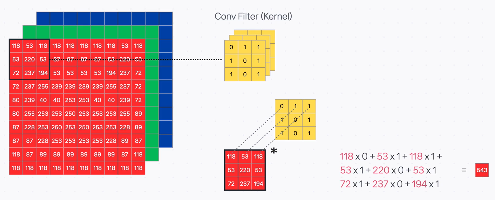
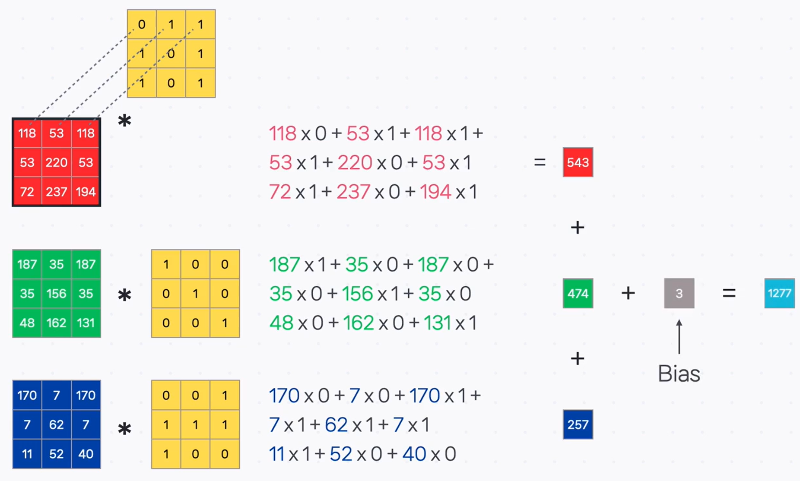
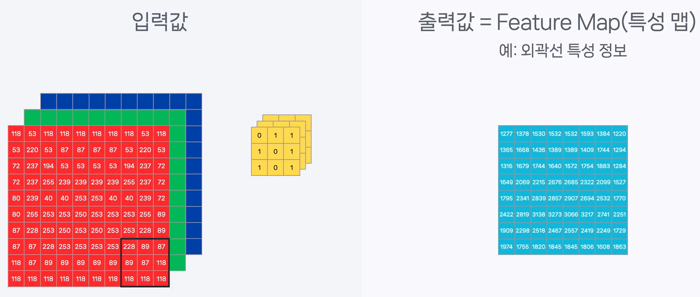
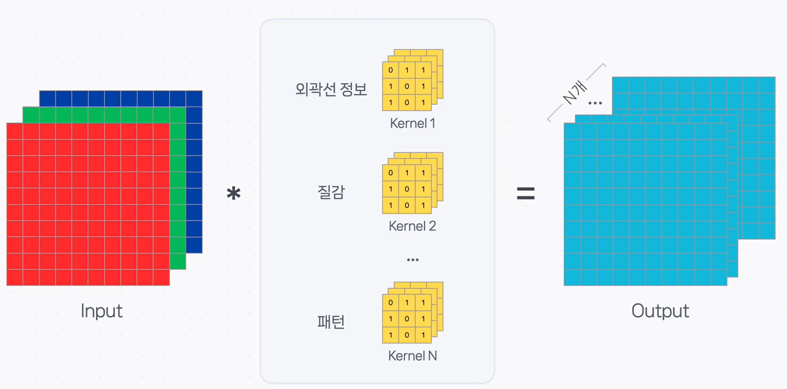

# 🔬 CNN의 심장, 컨볼루션 계층 (Convolution Layer) 파헤치기

지난 시간에는 CNN이 '작고 공유된 필터'를 사용해 이미지의 특징을 효율적으로 학습한다는 핵심 아이디어를 알아보았습니다. 이번 시간에는 그 아이디어가 실제로 구현되는 핵심 부품, **컨볼루션 계층(Convolution Layer)** 의 작동 방식을 자세히 살펴보겠습니다.

## 컨볼루션 연산: 특징을 찾아내는 방법

### 정의

**컨볼루션 연산(Convolution Operation)** 은 입력 데이터 위를 작은 **필터(커널)** 가 움직이면서, 각 위치의 지역적 특성을 하나의 값으로 압축하여 추출하는 계산 과정입니다.

### 비유와 설명

> **비유: 특징과 일치하는 정도를 채점하는 '돋보기 스캐너' 🔬**
>
> 특정 패턴(예: 수직선)을 감지하도록 설계된 돋보기(필터)를 이미지 위 한 칸에 올려놓는다고 상상해 보세요. 컨볼루션 연산은 그 칸의 이미지 조각이 돋보기의 패턴과 **얼마나 일치하는지를 계산하여 하나의 '일치 점수'** 로 나타내는 과정입니다. 이 점수가 높을수록 해당 위치에 그 특징이 존재할 확률이 높다는 의미입니다.

### 계산 과정 (합성곱)

컨볼루션 연산은 **합성곱(合成積)** 이라고도 불리며, 다음과 같은 단계로 이루어집니다.

1.  입력 데이터의 좌측 상단부터 필터와 동일한 크기의 영역을 지정합니다.
2.  해당 영역의 값과 필터의 값을 **같은 위치끼리 각각 곱합니다.**
3.  곱해진 모든 값들을 **전부 더하여** 하나의 최종값을 만듭니다.

- **입력 채널(Channel) 고려**: 컬러 이미지처럼 입력 데이터가 여러 채널(e.g., RGB)을 가지면, 필터 또한 동일한 수의 채널을 가집니다. 각 채널별로 합성곱을 계산한 뒤, 그 결과들을 모두 더하여 최종값을 구합니다.
- **편향(Bias) 추가**: 최종적으로 더해지는 **편향(bias)** 값 또한 필터와 함께 학습되는 중요한 파라미터입니다.

---

## 결과물: 특징 지도 (Feature Map)

### 정의

**특징 지도(Feature Map)** 는 필터 하나가 이미지 전체를 훑으며 계산한 결과(일치 점수)들을 모아놓은 2차원 행렬입니다. 이는 원본 이미지에서 **'특정 특징이 어디에 얼마나 강하게 나타나는지'** 를 보여주는 지도와 같습니다.

### 설명

필터는 이미지 위를 한 칸씩(또는 정해진 간격만큼) 이동하며 연산을 반복하고, 각 위치에서의 결과값을 새로운 행렬에 차곡차곡 기록합니다. 이렇게 완성된 특징 지도는 원본 이미지의 공간적(위치) 정보를 그대로 유지하고 있다는 중요한 특징이 있습니다.

---

## 연산 방식 조절하기

컨볼루션 연산의 동작 방식을 세밀하게 조절하기 위한 몇 가지 중요한 하이퍼파라미터가 있습니다.

### 커널 크기 (Kernel Size)

- **정의**: 특징을 감지하는 필터의 크기(가로x세로)를 의미합니다.
- **설명**: 더 넓은 영역의 정보를 종합하여 특징을 추출하고 싶다면 커널 크기를 키우고, 더 세밀하고 지역적인 특징을 원한다면 크기를 줄일 수 있습니다. (e.g., 3x3, 5x5)

### 스트라이드 (Stride)

- **정의**: 필터가 이미지 위를 이동하는 **보폭 또는 간격**을 의미합니다.
- **설명**: Stride가 1이면 한 픽셀씩, 2이면 두 픽셀씩 건너뛰며 이동합니다. Stride를 키우면 출력되는 특징 지도의 크기가 작아지므로, **계산량을 줄이면서도** 정보의 손실을 최소화하여 효율적으로 특징을 추출할 수 있습니다.

### 패딩 (Padding)

- **정의**: 컨볼루션 연산을 수행하기 전, 입력 데이터의 가장자리에 특정 값(보통 0)을 채워 넣어 크기를 조절하는 기법입니다.
- **설명**: 패딩은 두 가지 중요한 문제를 해결합니다.
  1.  **가장자리 정보 손실 방지**: 패딩이 없으면 필터가 중앙부 픽셀을 더 많이 스캔하게 되어 가장자리 정보가 학습에 덜 반영됩니다. 패딩은 가장자리 픽셀도 중앙 픽셀처럼 여러 번 연산에 포함될 기회를 줍니다.
  2.  **특징 지도 크기 유지**: 컨볼루션 연산을 거치면 특징 지도의 크기가 계속 작아지는데, 패딩을 통해 입력과 출력의 크기를 동일하게 유지할 수 있습니다.

---

## 컨볼루션 계층의 완성: 여러 개의 필터

### 정의

**컨볼루션 계층(Convolution Layer)** 은 각기 다른 특징을 감지하는 **여러 개의 컨볼루션 필터 묶음**으로 구성됩니다.

### 설명

우리가 이미지에서 찾아야 할 특징은 '수직선' 하나만이 아닙니다. '수평선', '녹색 동그라미', '빗살무늬 질감' 등 수많은 특징이 필요하죠.

컨볼루션 계층은 이처럼 **다양한 특징을 감지하는 여러 개의 필터**를 동시에 적용합니다. 필터가 N개 있다면, N개의 서로 다른 특징 지도가 결과물로 생성되며, 이 N개의 묶음이 바로 다음 계층으로 전달되는 것입니다.

---

## ✨ 핵심 요약

> **컨볼루션 계층은 학습 가능한 여러 개의 필터(커널)를 사용하여 입력 데이터의 지역적 특징을 추출하고, 그 결과를 특징 지도(Feature Map)로 만들어 다음 계층으로 전달하는 CNN의 핵심 부품입니다. 연산 방식은 커널 크기, 스트라이드, 패딩과 같은 하이퍼파라미터로 조절됩니다.**
