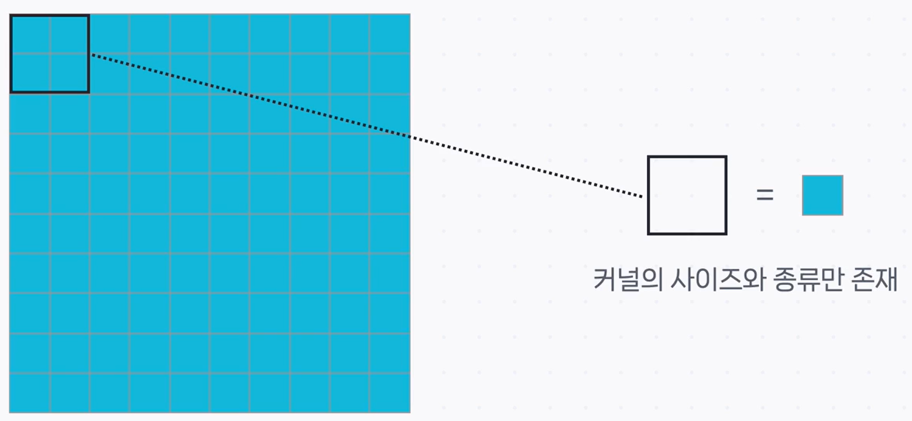
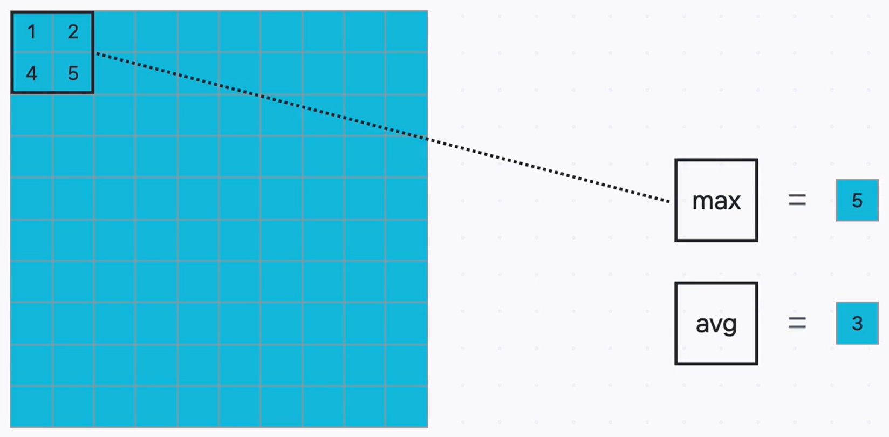
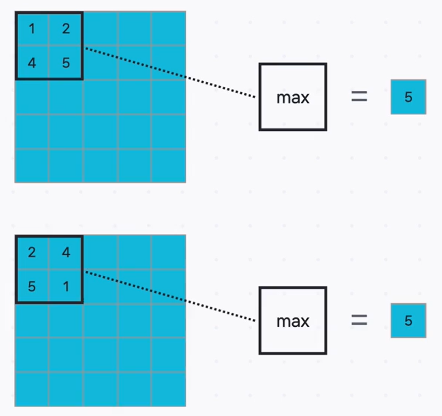

# 🗺️ 특징을 요약하고 압축하는 풀링 계층 (Pooling Layer)

CNN을 구성하는 또 다른 핵심 부품인 **풀링 계층(Pooling Layer)** 에 대해 알아보겠습니다. 컨볼루션 계층이 이미지의 세밀한 특징을 '추출'하는 역할을 했다면, 풀링 계층은 그 특징들을 '요약'하고 '압축'하는 역할을 합니다.

## 풀링 계층(Pooling Layer)이란?

### 정의

**풀링 계층**은 컨볼루션 계층을 거친 **특징 지도(Feature Map)의 크기를 의도적으로 줄이는 다운샘플링(Downsampling)** 을 수행하는 계층입니다.

### 비유와 설명

> **비유: 책의 핵심 내용 요약하기 📖**
>
> 책 한 챕터의 모든 문장을 다 기억하기는 어렵습니다. 대신 우리는 각 문단의 **핵심 키워드나 주제 문장**만 뽑아서 요약하죠. 풀링은 이처럼 특징 지도의 특정 영역에서 **가장 중요하거나 대표적인 정보**만 남기고 나머지는 버려서, 전체적인 정보의 양을 효과적으로 줄이는 과정입니다. 100x100 픽셀 이미지를 50x50으로 줄이는 것처럼 해상도를 낮추는 것과 같습니다.

---

## 풀링 연산: 학습 없이 요약하기

### 정의

**풀링 연산**은 컨볼루션 연산처럼 정해진 크기의 커널(Kernel)을 옮겨가며 영역 내의 값들을 하나의 대표값으로 압축하는 과정입니다. 하지만 결정적으로, **학습해야 할 가중치(파라미터)가 전혀 없다**는 차이점이 있습니다.

### 설명

풀링 커널에는 학습되는 가중치가 없으며, 오직 **커널의 크기**와 **어떤 규칙으로 값을 요약할지(종류)** 만 정해져 있습니다. 규칙에 따라 해당 영역을 대표하는 값 하나를 출력할 뿐입니다.

---

## 풀링의 두 가지 대표 방법

### 1. 최대 풀링 (Max Pooling)

- **정의**: 지정된 영역 안에서 **가장 큰(max) 값**을 대표값으로 선택하는 방식입니다.
- **설명**:
  > **비유: 문단의 핵심 키워드 찾기 🔑**
  >
  > 최대 풀링은 해당 영역에서 가장 두드러지거나 활성화된 특징(가장 높은 '일치 점수')을 뽑아내는 것과 같습니다. 이는 이미지의 질감이나 경계선처럼 가장 중요한 특징을 보존하는 데 효과적이며, **실전에서 가장 널리 사용되는 방식**입니다.

### 2. 평균 풀링 (Average Pooling)

- **정의**: 지정된 영역 안의 **모든 값들의 평균**을 대표값으로 선택하는 방식입니다.
- **설명**:
  > **비유: 문단의 전반적인 뉘앙스 파악하기 💬**
  >
  > 평균 풀링은 해당 영역의 특징들을 전반적으로 부드럽게 요약하는 것과 같습니다. 모든 정보를 종합적으로 고려하지만, 최대 풀링에 비해 특징이 다소 희석될 수 있습니다.

[Image comparing Max and Average Pooling]

---

## 풀링을 사용하는 이유 (장점)

### 1. 계산 효율성 증대 및 과적합 방지

- **정의**: 특징 지도의 크기를 줄여 모델이 처리해야 할 데이터의 양과 파라미터 수를 감소시킵니다.
- **설명**: 데이터의 크기가 줄어들면 계산량이 줄어 학습 속도가 빨라지며, 모델의 복잡도가 낮아져 과적합을 방지하는 효과도 있습니다.

### 2. 위치 변화에 대한 강건성 확보 (Local Translation Invariance)

- **정의**: 특징의 위치가 특정 영역 내에서 약간 변하더라도, 풀링의 결과는 동일하게 유지되는 특성입니다.

- **설명**:
  > **비유: 요약의 마법 ✨**
  >
  > 문단에서 핵심 키워드의 위치가 첫 문장이든 마지막 문장이든, 요약 결과에는 '그 키워드가 존재한다'는 사실이 동일하게 반영됩니다.
  > [Image illustrating local translation invariance in pooling]
  >
  > 풀링도 마찬가지로, 위 예시처럼 커널 영역 내에서 5라는 최댓값의 위치가 바뀌어도 결과는 동일하게 5가 나옵니다. 이를 통해 모델은 특징의 **정확한 위치보다는 존재 여부**에 더 집중하게 되어, 이미지 내 객체의 위치가 약간 변하더라도 잘 인식할 수 있게 됩니다.

---

## 풀링의 주요 파라미터

풀링 계층은 컨볼루션 계층과 유사한 하이퍼파라미터를 가지지만, 사용 목적에 따라 주로 사용하는 값이 정해져 있습니다.

- **커널 크기 (Kernel Size)**: 보통 2x2 또는 3x3 크기를 사용합니다.
- **스트라이드 (Stride)**: 특징 지도의 크기를 절반으로 줄이는 것이 일반적인 목적이므로, **보통 커널 크기와 동일한 값인 2**를 사용합니다.
- **패딩 (Padding)**: 크기를 줄이는 것이 목적이므로, **패딩은 대부분 적용하지 않습니다.**

---

## 마치며: CNN의 기본 조합

지금까지 CNN의 양대 산맥인 **컨볼루션 계층**과 **풀링 계층**에 대해 알아보았습니다. 실제 CNN 모델에서는 이 두 계층이 기본 단위가 되어 여러 겹으로 쌓아 올려집니다.

> **[컨볼루션 계층 → 활성화 함수 → 풀링 계층]** 이 조합이 반복적으로 사용되며, 층이 깊어질수록 모델은 이미지의 단순한 특징(선, 면)에서 복잡한 특징(눈, 코, 입)으로 점차 고차원적인 정보를 학습하게 됩니다.

다음에는 이 부품들이 실제로 어떻게 조립되어 대표적인 CNN 모델들을 만들어냈는지 알아보겠습니다.

---

## ✨ 핵심 요약

> **풀링 계층은 컨볼루션 계층이 추출한 특징 지도(Feature Map)를 요약하고 압축(다운샘플링)하는 역할을 합니다. 학습 가능한 가중치 없이, 최대 풀링(Max Pooling) 등의 규칙을 통해 데이터의 크기를 줄여 계산 효율을 높이고, 위치 변화에 덜 민감한 강건한 모델을 만드는 데 기여합니다.**
