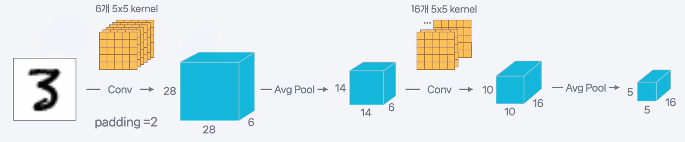
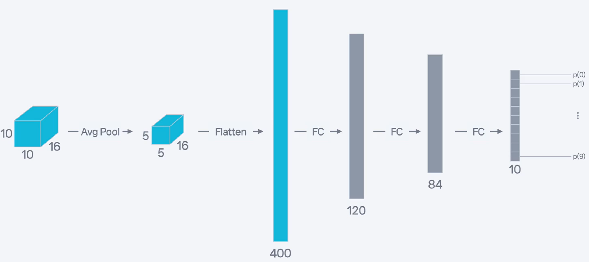
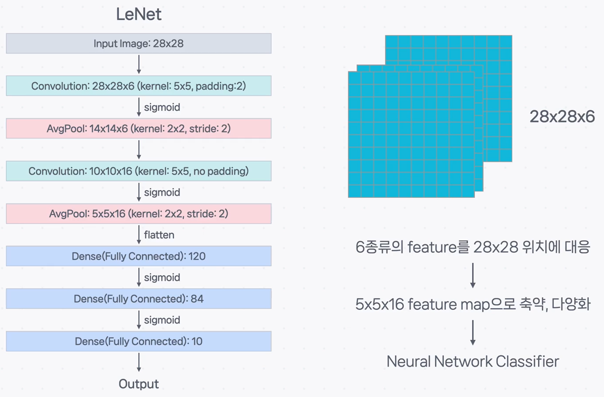

# 📜 CNN의 아버지, LeNet 모델 구조 파헤치기

CNN의 기본 부품인 컨볼루션과 풀링 계층에 대해 알아보았으니, 이제 이 부품들이 실제로 어떻게 조립되어 이미지 인식의 역사를 바꾼 모델을 만들어냈는지 살펴보겠습니다. 그 첫 번째 주인공은 바로 **LeNet**입니다.

## 전설의 시작: LeNet의 등장 배경

### 정의

**LeNet**은 1998년 얀 르쿤(Yann LeCun) 교수가 발표한 논문 `Gradient-based learning applied to document recognition`에서 소개된, **현대적인 CNN 구조의 시초**가 된 선구적인 모델입니다.

### 설명

> **탄생 배경: 우편번호를 읽어라! ✉️**
>
> LeNet은 당시 **미국 우편 공사의 우편번호 손글씨**를 자동으로 인식하기 위한 실용적인 목적으로 개발되었습니다. 이 연구 과정에서 수집되고 만들어진 데이터셋이 바로 오늘날까지 딥러닝의 "Hello, World!"로 불리는 **MNIST 손글씨 숫자 데이터셋**입니다.

MNIST는 다양한 사람들의 필기체로 쓰인 0~9까지의 숫자 이미지(28x28 픽셀, 흑백) 7만 장으로 구성된 데이터셋으로, LeNet의 성능을 증명하고 이후 수많은 이미지 인식 모델의 성능을 측정하는 기준(벤치마크)이 되었습니다.

---

## LeNet의 모델 구조 톺아보기

LeNet은 크게 두 부분으로 나눌 수 있습니다. 이미지의 특징을 추출하는 **'특징 추출(Feature Extraction)'** 부분과, 추출된 특징을 보고 어떤 숫자인지 분류하는 **'분류(Classification)'** 부분입니다.

### 1부: 특징 추출 (Convolution + Pooling)

이 부분에서는 **[컨볼루션 → 풀링]** 조합을 두 번 반복하여 이미지 속에서 점점 더 복잡하고 추상적인 특징을 학습합니다.

#### **1단계: 첫 번째 컨볼루션 (Convolution C1)**

- **정의**: 6개의 5x5 커널(필터)을 사용하여 입력 이미지(28x28)에서 6개의 특징 지도(28x28x6)를 추출합니다. 이미지 크기 유지를 위해 패딩(padding=2)이 적용됩니다.
- **설명**: 이 단계에서는 이미지의 가장 기본적인 특징인 **가로선, 세로선, 대각선, 둥근 곡선 등**을 감지합니다.

#### **2단계: 첫 번째 풀링 (Pooling S2)**

- **정의**: 평균 풀링(Average Pooling)을 통해 특징 지도의 크기를 절반(14x14x6)으로 줄입니다.
- **설명**: 특징의 정확한 위치보다는 **존재 여부**에 집중하도록 정보를 압축하고, 계산량을 줄여 효율성을 높입니다.

#### **3단계: 두 번째 컨볼루션 (Convolution C3)**

- **정의**: 16개의 5x5 커널을 사용하여, 이전 단계에서 추출된 6개의 특징 지도를 조합해 16개의 더 복잡한 특징 지도(10x10x16)를 만듭니다.
- **설명**: 1단계에서 찾은 단순한 선과 곡선들을 조합하여, **숫자 '8'의 위아래 동그라미나 숫자 '4'의 꺾인 부분**과 같이 더 의미 있는 형태를 감지합니다.

#### **4단계: 두 번째 풀링 (Pooling S4)**

- **정의**: 다시 한번 풀링을 통해 특징 지도의 크기를 절반(5x5x16)으로 줄입니다.
- **설명**: 더 복잡해진 특징 정보를 다시 한번 압축하여, 위치 변화에 덜 민감하고 핵심적인 정보만 남깁니다.

### 2부: 분류 (Fully Connected Layers)

특징 추출이 끝나면, 이제 압축된 최종 특징 지도를 보고 어떤 숫자인지 판단하는 단계입니다.

#### **5단계: 평탄화 (Flatten)**

- **정의**: 2차원 형태의 특징 지도(5x5x16)를 1차원의 긴 벡터(400개)로 쭉 펼칩니다.
- **설명**: 이미지 형태의 데이터를 최종 판단을 내릴 완전 연결 신경망(FCN)에 넣기 위한 준비 과정입니다.

#### **6단계: 완전 연결 계층 (Fully Connected F5, F6, Output)**

- **정의**: 3개의 완전 연결 계층을 거쳐, 400개의 특징 벡터를 최종적으로 10개의 출력값으로 변환합니다.
- **설명**: 추출된 고차원적인 특징들을 종합하여, 입력 이미지가 0부터 9까지의 각 숫자일 확률을 계산합니다. 이 중 가장 높은 확률을 가진 숫자가 모델의 최종 예측 결과가 됩니다.

---

## LeNet이 남긴 유산

### 정의

LeNet은 **컨볼루션과 풀링 계층을 반복적으로 쌓아 이미지의 계층적 특징을 학습**하고, 이를 완전 연결 계층으로 분류하는 현대적인 CNN의 기본 구조를 처음으로 제시하고 그 효과를 실증한 모델입니다.

### 설명

> **딥러닝의 가능성을 증명하다 🚀**
>
> LeNet은 복잡한 손글씨 인식 문제인 MNIST 데이터셋에서 **98%** 라는 높은 정확도를 달성했습니다. 이는 당시의 다른 머신러닝 기법들을 뛰어넘는 성능으로, CNN이라는 구조가 실제 이미지 인식 문제에 매우 효과적이라는 것을 세상에 증명한 사건이었습니다. LeNet은 현대 CNN의 명실상부한 시초라고 할 수 있습니다.

---

## ✨ 핵심 요약

> **LeNet은 [컨볼루션-풀링] 블록을 반복하여 이미지의 특징을 계층적으로 추출하고, 마지막에 완전 연결 계층으로 이를 분류하는 현대 CNN의 기본 청사진을 제시한 선구적인 모델입니다. MNIST 데이터셋에서 높은 성능을 보이며 딥러닝의 실용적 가능성을 처음으로 증명했습니다.**
