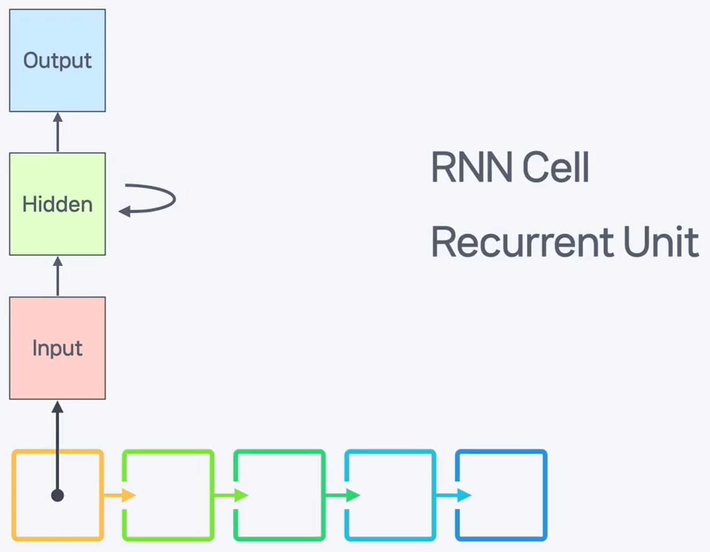
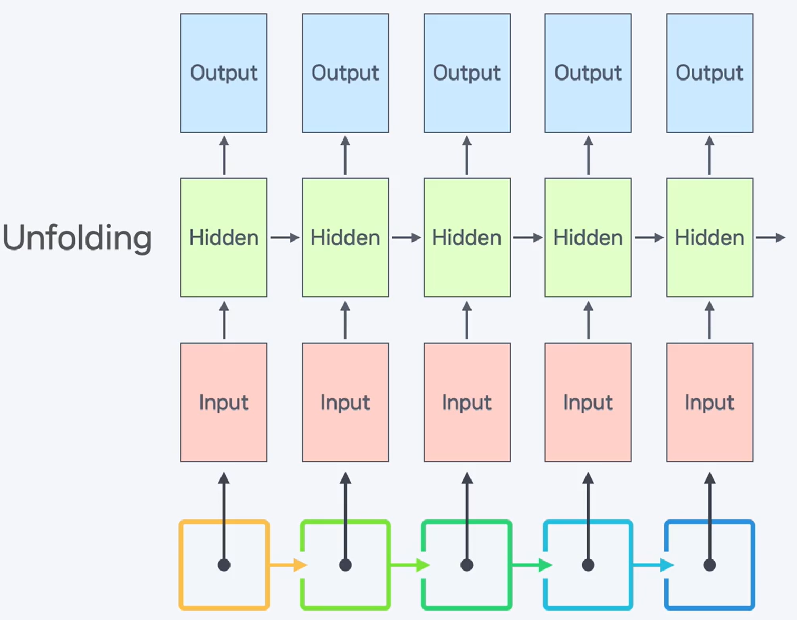
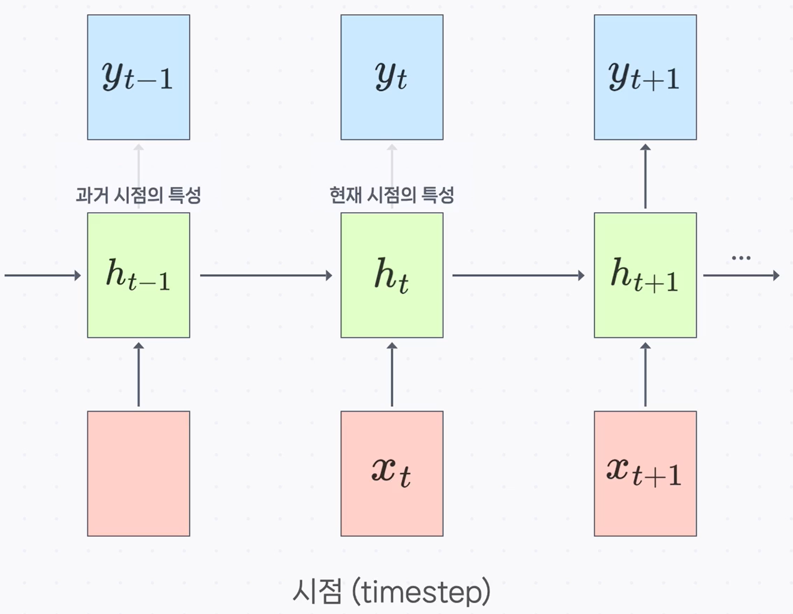
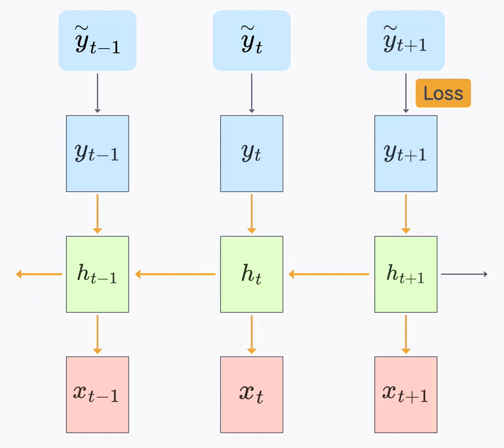

# 💬 순서와 맥락을 기억하는 신경망, RNN의 기본 원리

CNN이 이미지의 '공간적' 특징을 파악하는 데 특화되었다면, 이번에는 **'시간적' 또는 '순서적' 특징**을 파악하는 데 최적화된 **RNN(Recurrent Neural Network)** 에 대해 알아보겠습니다.

## 순서가 있는 데이터, 시퀀스 데이터(Sequence Data)란?

### 정의

**시퀀스 데이터**는 **연속된 정보가 순서대로 나열**되어 있는 데이터를 의미합니다. 데이터의 순서 자체가 중요한 의미를 가지는 것이 특징입니다.

### 설명

우리가 일상에서 접하는 많은 데이터가 시퀀스 데이터에 해당합니다.

- **텍스트 데이터**: 단어 또는 문자의 순서가 문장의 의미를 결정합니다.
- **음성 데이터**: 시간에 따른 소리 신호(음파)의 연속입니다.
- **시계열 데이터**: 날씨, 주가, 센서 값처럼 일정한 시간 간격으로 측정된 데이터입니다.
- **비디오 데이터**: 시간에 따라 연속되는 이미지(프레임)의 나열입니다.

이러한 데이터들은 '이전' 데이터가 '현재' 데이터에 영향을 미치고, '현재' 데이터가 '미래' 데이터에 영향을 주는 **맥락(Context)** 을 가지고 있습니다.

---

## 시퀀스 데이터, 무엇이 문제일까?

### 정의

FCN이나 CNN과 같은 기존의 신경망 구조는 **데이터의 순서나 시간적 연속성을 고려하지 않기 때문에** 시퀀스 데이터를 효과적으로 처리하기 어렵습니다.

### 비유와 설명

> **비유: 단어 카드 뭉치 🃏**
>
> "나는 어제 학교에 갔다"라는 문장을 단어 카드로 만들어 순서를 뒤섞어 버린다면, 우리는 원래의 의미를 파악할 수 없습니다.
>
> - **FCN의 한계**: 문장 전체를 하나의 거대한 입력으로 취급하여 너무 많은 가중치를 학습해야 하고, 단어의 순서 정보를 잃어버립니다.
> - **CNN의 한계**: "나는 어제", "어제 학교에"처럼 짧은 구간의 지역적 정보는 파악할 수 있지만, "나는 ... 갔다"처럼 멀리 떨어진 단어 간의 중요한 문법적 관계를 파악하기 어렵습니다. 또한, 문장의 길이에 따라 입력 크기를 맞춰야 하는 문제도 있습니다.

---

## RNN의 핵심 아이디어: 과거를 기억하는 순환 구조

### 정의

**RNN(Recurrent Neural Network, 순환 신경망)** 은 시퀀스 데이터의 순서와 맥락을 학습하기 위해, 이전 타임스텝(timestep)의 처리 결과를 **'기억'** 하여 현재 타임스텝의 입력으로 함께 사용하는 신경망 구조입니다.

### 비유와 설명

> **비유: 책을 읽는 우리의 뇌 🧠**
>
> 우리가 책을 읽을 때, 현재 단어를 이해하기 위해 방금 읽었던 앞 단어와 문장의 내용을 기억합니다. RNN은 이처럼 **이전 정보를 기억하는 메모리**를 가지고, 그 기억을 바탕으로 현재 정보를 해석하는 방식을 모방합니다. 이 덕분에 가변적인 길이의 시퀀스 데이터를 처리하고, 데이터의 순서 정보를 효율적으로 학습할 수 있습니다.

---

## RNN의 심장: RNN 셀과 은닉 상태

### 정의

RNN의 핵심 구성 단위를 **RNN 셀(RNN Cell)** 또는 **순환 유닛(Recurrent Unit)** 이라고 합니다. 이 셀의 가장 중요한 특징은 내부에 **은닉 상태(Hidden State)** 라는 '메모리'를 가지고 있다는 점입니다.

### 설명

- **은닉 상태 (Hidden State, $h_t$)**: 각 타임스텝에서 계산되는 결과이자, **과거의 모든 정보를 요약한 '메모리'** 역할을 합니다. 이 은닉 상태가 다음 타임스텝의 셀로 전달되어 과거의 맥락을 이어주는 역할을 합니다.

이러한 순환 구조를 시간의 흐름에 따라 쭉 펼쳐보면 RNN의 전체 동작 방식을 더 쉽게 이해할 수 있는데, 이를 **언폴딩(Unfolding)** 이라고 합니다.

---

## RNN의 동작 방식과 학습 과정

### 동작 방식

RNN은 각 타임스텝($t$)마다 다음과 같은 과정을 반복합니다.

1.  **입력**: 현재 타임스텝의 입력 데이터($x_t$)와 **이전 타임스텝의 메모리($h_{t-1}$)** 를 함께 입력으로 받습니다.
2.  **계산**: 두 입력을 바탕으로 **현재 타임스텝의 메모리($h_t$)** 를 계산하여 업데이트합니다.
3.  **출력**: 업데이트된 메모리($h_t$)를 바탕으로 **현재 타임스텝의 최종 출력값($y_t$)** 을 계산합니다.
4.  **전달**: 업데이트된 메모리($h_t$)는 다음 타임스텝($h_{t+1}$)으로 그대로 전달됩니다.

### 학습 과정 (BPTT)

- **정의**: RNN의 학습은 언폴딩된 전체 네트워크에 대해 역전파를 수행하는 **BPTT(Backpropagation Through Time)** 라는 방식을 사용합니다.
- **설명**: 마지막 타임스텝에서 계산된 손실(Loss)을 시간의 역순으로, 즉 과거 방향으로 거슬러 올라가며 모든 타임스텝에 걸쳐있는 가중치를 업데이트합니다.

---

## ✨ 핵심 요약

> **RNN은 '은닉 상태(Hidden State)'라는 내부 메모리를 통해 과거의 정보를 현재까지 전달하는 순환 구조를 가진 신경망입니다. 이 덕분에 데이터의 순서와 맥락이 중요한 텍스트, 음성, 시계열과 같은 시퀀스 데이터를 효과적으로 처리할 수 있습니다.**
