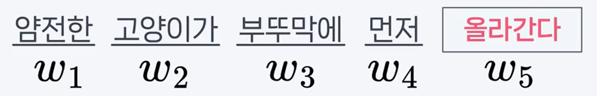
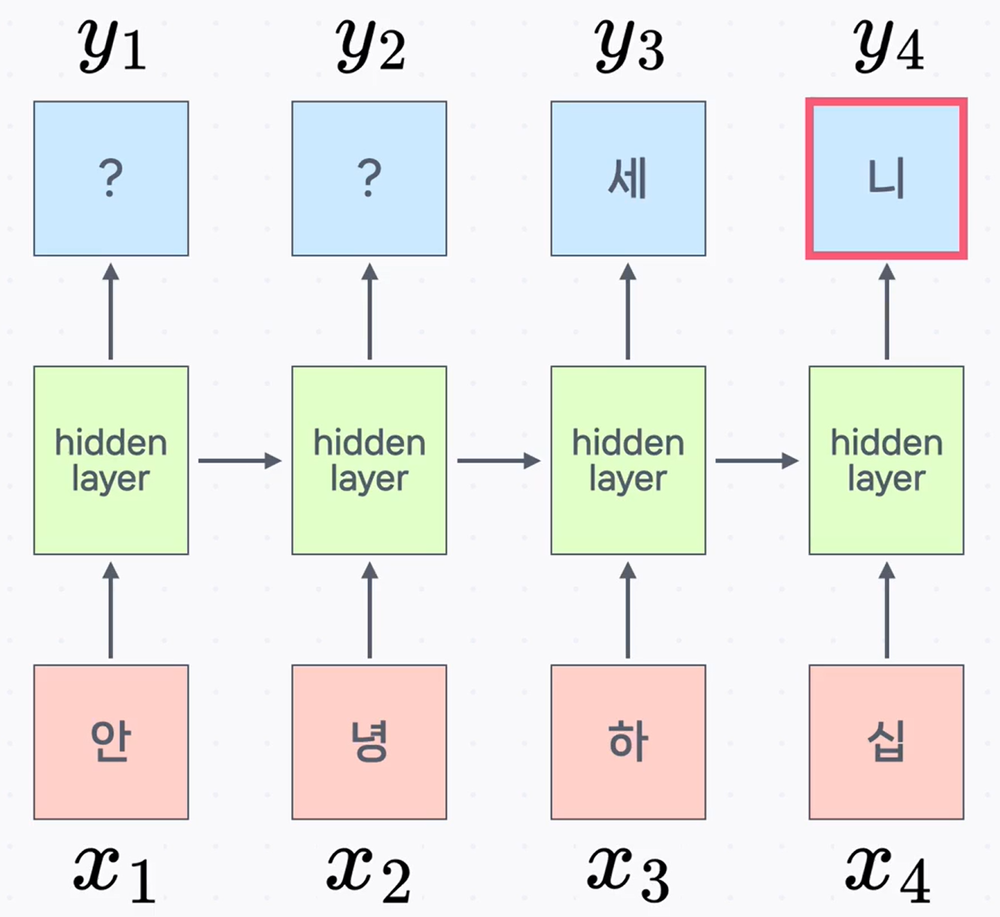
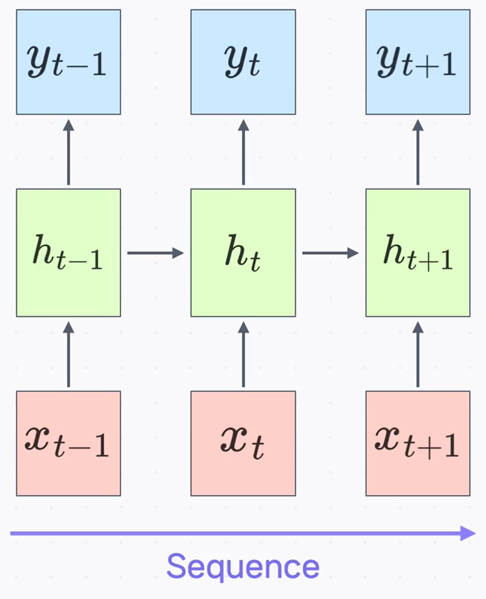
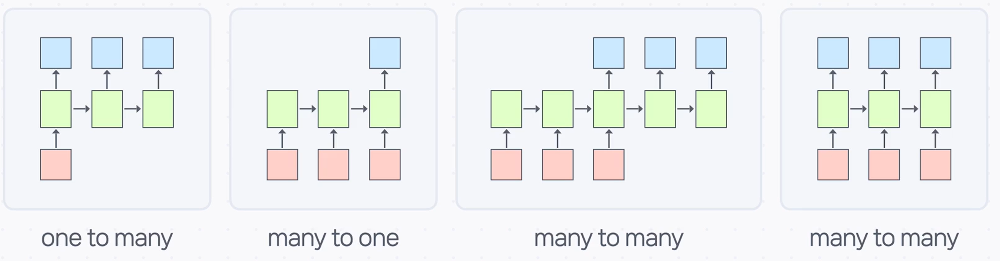
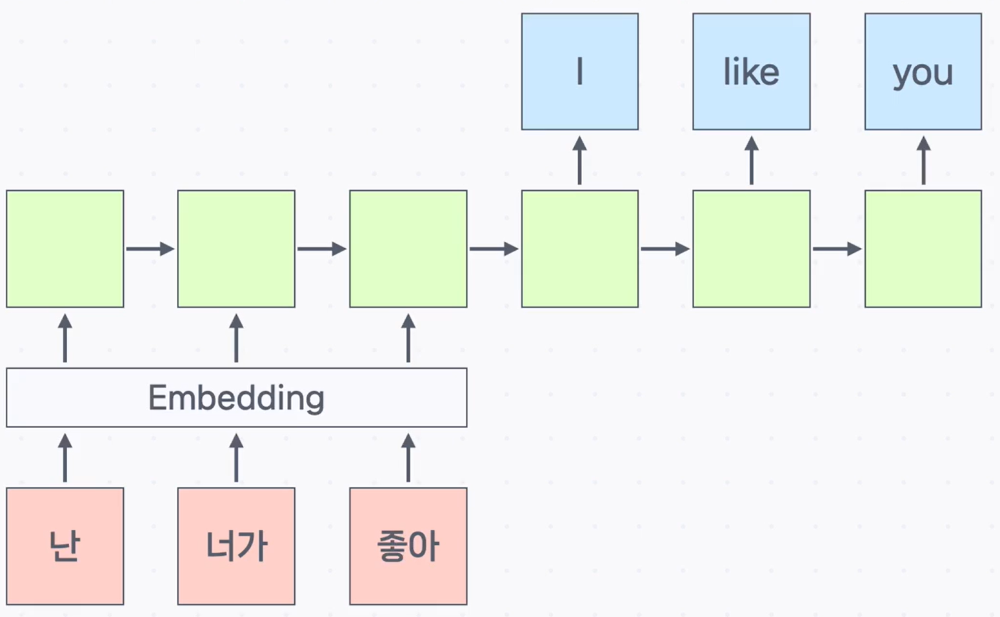
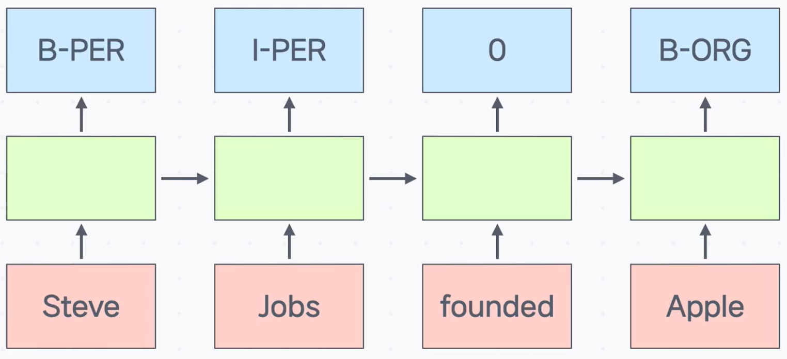

# RNN의 구조와 활용 (입문 가이드)

입문자 관점에서 RNN(Recurrent Neural Network)이 **무엇을, 어떻게** 처리하는지 그림과 간단한 기호만으로 정리했습니다. 아래 설명은 원문에 있는 예시와 개념만을 **정확하고 명료하게** 다듬은 것입니다.

---

## 1) 문제 정의: “다음에 무엇이 올까?”

언어 모델은 **단어(또는 글자) 시퀀스가 등장할 확률**을 학습해, **다음에 올 단어/글자**를 예측합니다.
쉽게 말해, 앞의 말들을 보고 **뒤에 가장 자연스러운 말**을 고르는 모델입니다.

위와 같은 문장에서 대부분은 마지막 단어로 **‘올라간다’** 를 떠올립니다. 이런 **다음 단어 예측** 문제를 풀 때 RNN이 효과적입니다.

---

## 2) RNN의 기본 동작: 시퀀스를 따라 기억을 잇는다

RNN은 시점 $t$마다

- 입력: $x_t$ (글자/단어)
- 은닉 상태: $h_t$ (이전까지의 맥락 요약)
- 출력: $y_t$ (예측)

을 다룹니다. 핵심은 **직전까지의 정보 $h_t$** 와 **새 입력 $x_{t+1}$** 로 **다음 상태 $h_{t+1}$** 를 만든다는 점입니다.

예를 들어 $x_1=$‘안’, $x_2=$‘녕’, $x_3=$‘하’가 순서대로 들어오면, 모델은 그동안의 맥락($h_3$)을 바탕으로 **다음 글자 $y_3$** 를 예측합니다. 적절히 학습되었다면 $y_3$는 **‘세’** 일 가능성이 큽니다.

이어서 $x_4=$‘십’이 들어오면 문맥이 **“안녕하십…”** 으로 바뀌고, 모델은 다음 글자 $y_4$를 **‘니’** 로 예측하는 쪽으로 확률을 높입니다.

> **기호 정리**
>
> - $x_t$: $t$번째 입력(글자/단어)
> - $h_t$: $t$시점까지 입력을 요약한 은닉 상태
> - $y_t$: $t$시점의 예측(다음 글자/단어 등)

---

## 3) 다양한 RNN 구조: 입력/출력 길이에 따라 달라진다

아래 그림처럼 **입력 시퀀스 길이**와 **출력 시퀀스 길이** 조합에 따라 구조가 달라집니다.

### 3-1. One to Many (이미지 캡셔닝)

이미지 한 장(하나의 입력)을 받아 **여러 단어로 된 문장(여러 출력)** 을 생성합니다. 그림 속 예시는 이미지 특징을 입력받아 설명 문장을 순서대로 만들어내는 **Image Captioning** 작업입니다.

### 3-2. Many to One (감성 분석)

여러 단어로 된 문장(여러 입력)을 보고 **하나의 라벨**(긍정/부정 등)을 예측합니다. 대표적으로 **감성 분석(Sentiment Analysis)** 이 여기에 해당합니다.

### 3-3. Many to Many (번역: 입력 뒤에 출력이 이어지는 형태)

입력 문장이 들어오면, 그 문맥을 따라 **번역된 문장**이 이어서 생성됩니다. 즉, **여러 입력 → 여러 출력** 구조이며, 기계 번역이 대표 사례입니다.

### 3-4. Many to Many (시점별 라벨링: NER)

**각 입력 시점마다 바로 대응되는 출력 라벨**이 나오는 경우입니다. 예: **개체명 인식(NER)**

- _Steve_ **B-PER**, _Jobs_ **I-PER**, _founded_ **O**, _Apple_ **B-ORG**
- 접두어 의미

  - **B**: Begin(개체의 시작 단어)
  - **I**: Inside(개체의 내부/마지막 단어)
  - **O**: Outside(개체가 아님)

---

## 4) 흐름 정리

- **문제 정의**: 앞선 시퀀스를 보고 다음 토큰을 자연스럽게 예측(언어 모델).
- **모델링 아이디어**: RNN은 $h_t$로 과거 맥락을 요약하고 $x_{t+1}$과 합쳐 $h_{t+1}$을 갱신해가며 예측을 이어간다.
- **훈련 가정**: “적절한 데이터셋으로 학습되었다면” 예시처럼 자연스러운 다음 글자/단어를 출력한다.
- **결과 해석**: 작업별로 입력/출력 길이가 달라 One-to-Many, Many-to-One, Many-to-Many 구조로 응용된다(번역, NER 등).

---

## 핵심 요약

- RNN은 **이전까지의 맥락 $h_t$** 와 **새 입력 $x_{t+1}$** 로 다음 상태 $h_{t+1}$을 만들어 **순서가 있는 데이터**를 다룹니다.
- 언어 모델처럼 **다음 단어/글자 예측**에 잘 맞으며, 예시 문맥이 바뀌면 예측도 그에 맞게 달라집니다.
- 입력/출력 길이에 따라 **One-to-Many(캡셔닝)**, **Many-to-One(감성 분석)**, **Many-to-Many(번역/NER)** 등으로 활용됩니다.
- NER에서는 시점마다 라벨을 붙이며 **B/I/O** 태깅으로 개체의 시작·내부·비개체를 구분합니다.
