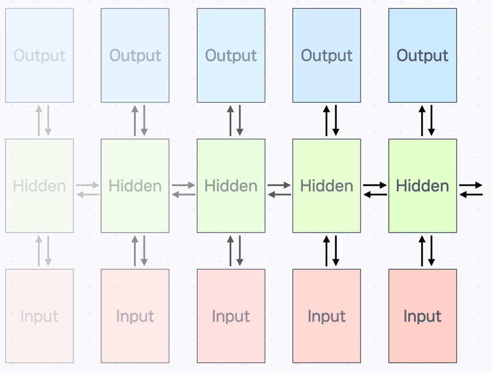
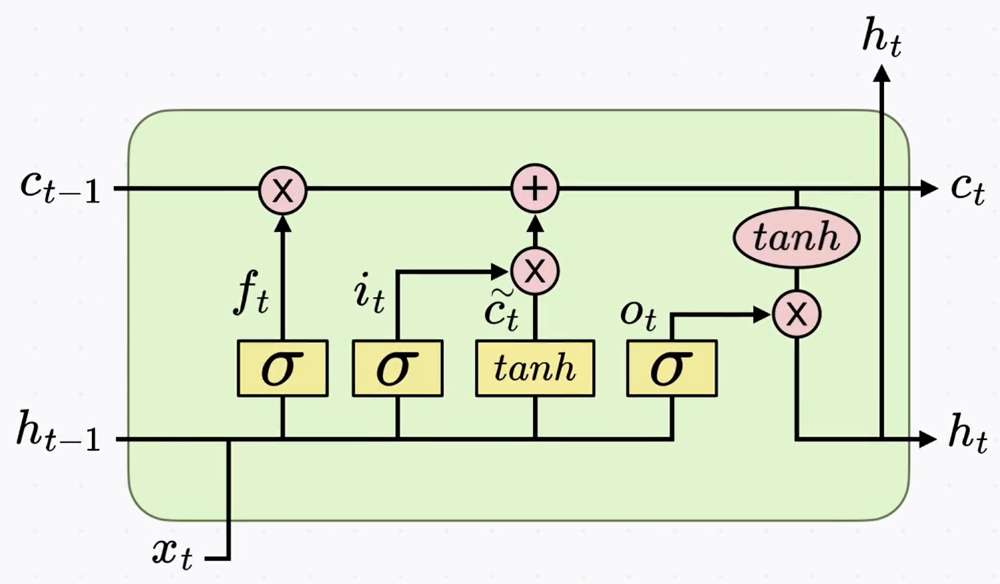
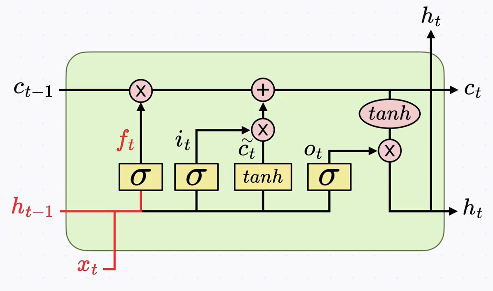
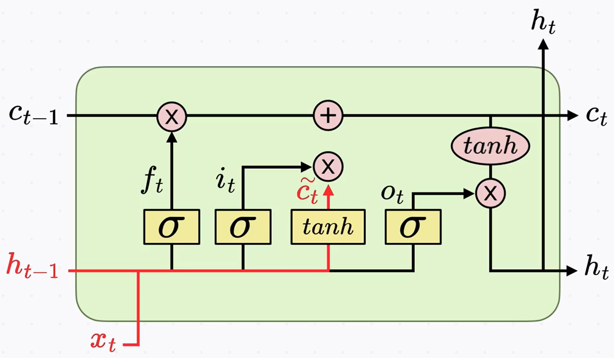
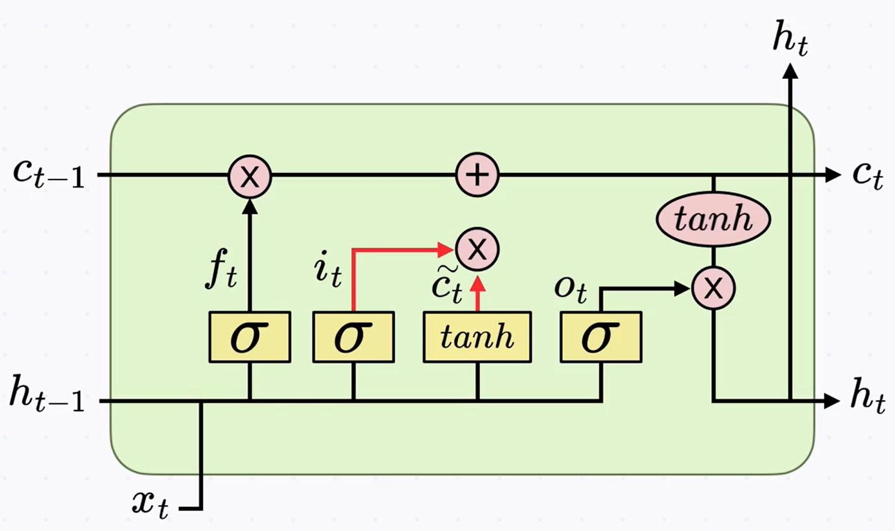
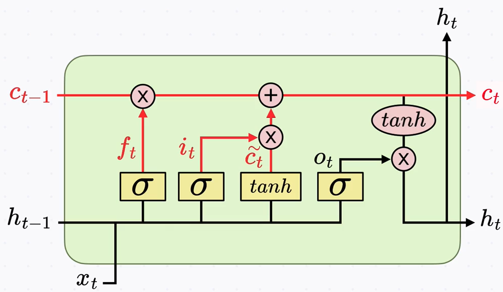
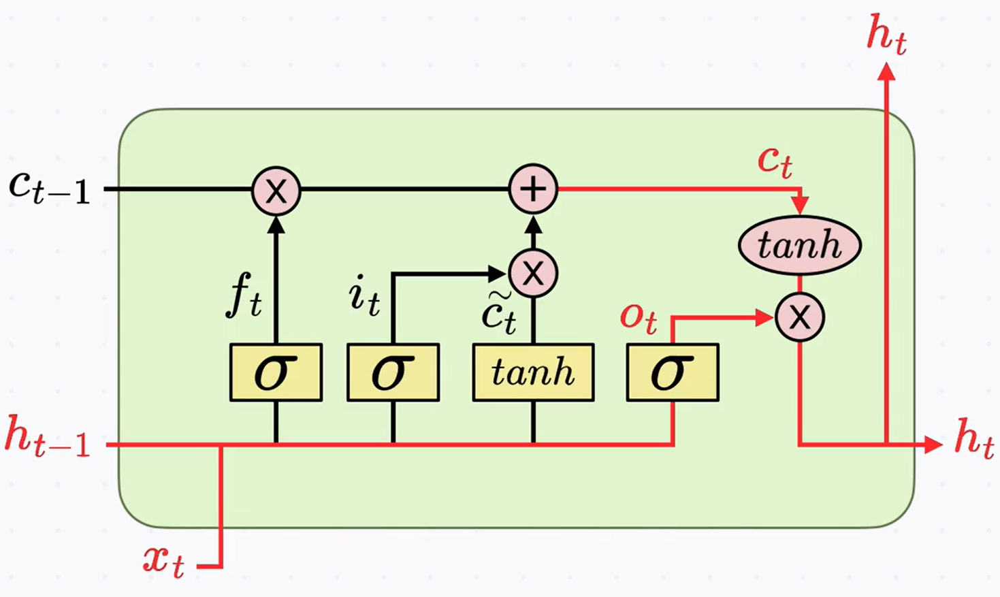

# RNN의 한계와 LSTM

## 1) 문제 정의: RNN은 왜 “장기 기억”이 약할까?

- RNN의 은닉 상태(hidden state)는 과거 시점의 입력이 반영된 **일종의 기억**입니다.
- 하지만 **단기 기억(Short-term Memory)** 에 강하고, **아주 오래 전 정보**는 잘 보존하지 못합니다.
- 이 한계를 해결하기 위해 **LSTM** 구조가 고안되었습니다.

---

## 2) 원인: 기울기 소실·폭주(Gradient Vanishing/Exploding)

- 딥러닝 학습에서 층(또는 시점)을 거칠수록 초기 정보의 영향은 줄어듭니다.
- 특히 RNN은 **모든 시점에서 동일한 가중치**를 반복적으로 곱하므로, 역전파 시 **기울기**가

  - 0에 가까워지며 **소실**되거나
  - 너무 커져 **폭주**할 수 있습니다.

- 따라서 멀리 떨어진 정보 사이의 연관성(**Long-term dependency**)을 잡기 어렵습니다.

---

## 3) 해결 아이디어: 정보가 줄지도 늘지도 않게 “경로 + 게이트” 추가

- 시간에 따라 정보가 **점점 줄거나 늘어나지 않도록** 하는 **직통 경로**를 두고,
- 그 경로로 무엇을 **기억/망각/출력**할지 **게이트(Gate)** 로 **조절**합니다.
- 이 아이디어가 적용된 구조가 **LSTM (Long Short-Term Memory)** 입니다.

---

## 4) LSTM의 구성요소 한눈에 보기

- 입력 $x_t$ (input state)
- 출력 $h_t$ (**output state**)
- **셀 상태 $c_t$**: LSTM의 **메모리(단기 기억 저장소)**
- 게이트:

  - $i_t$ (**input gate**) – 새 정보를 **얼마나 반영**할지
  - $f_t$ (**forget gate**) – 이전 기억을 **얼마나 지울지**
  - $o_t$ (**output gate**) – 현재 기억을 **얼마나 내보낼지**

---

## 5) 게이트 동작 원리

### (1) Forget gate $f_t$

- 입력: 이전 출력 $h_{t-1}$, 현재 입력 $x_t$
- 계산: 시그모이드 → $f_t \in (0,1)$
- 역할: **이전 셀 상태 $c_{t-1}$** 에 **곱**해 _얼마나 잊을지_ 결정

  - 0에 가까우면 **완전히 잊음**, 1에 가까우면 **그대로 유지**

---

### (2) Input gate $i_t$ + 후보 셀 상태 $\tilde{c}_t$

**2-1. 후보 생성** 

- $x_t, h_{t-1}$ 로부터 **후보 셀 상태** $\tilde{c}_t$ 계산 (tanh 적용, 범위 $-1\sim1$)
- 기존 메모리 $c_{t-1}$에 **무엇을 더/뺄지** 제안하는 값

**2-2. 반영 강도 결정** 

- 동일한 입력으로 **input gate $i_t$** 계산 (시그모이드, $0\sim1$)

**2-3. 새 셀 상태 업데이트** 

- **망각 후 메모리** $c_{t-1} * f_t$ 와
  **새 정보 반영분** $\tilde{c}_t * i_t$ 를 **더해** 최종 $c_t$ 계산

$$
\boxed{\,c_t = (c_{t-1} * f_t) + (\tilde{c}_t * i_t)}
$$

> **수식 기호 설명(최초 1회)**
>
> - $x_t$: $t$시점 입력, $h_t$: $t$시점 **출력 상태**(output state)
> - $c_t$: $t$시점 **셀 상태**(메모리)
> - $f_t, i_t, o_t$: 각각 **forget/input/output gate** (시그모이드 결과, 0\~1)
> - $\tilde{c}_t$: **후보 셀 상태** (tanh 결과, $-1\sim1$)

> 역할 요약: **이번 입력**과 **이전 정보**를 토대로,
> *잊을 것*과 *새로 저장할 것*을 정해 **메모리 $c_t$** 를 갱신합니다.

---

### (3) Output gate $o_t$와 출력 $h_t$

- 현재 입력 $x_t$, 이전 출력 $h_{t-1}$로 **output gate $o_t$** 계산
- $c_t$ 를 **tanh**로 스케일한 뒤 $o_t$와 **곱**해 **현재 출력 $h_t$** 생성
- 해석: $o_t$ 값이 클수록 **현재 기억을 더 많이 밖으로 내보냄**

---

## 6) 정리: 왜 LSTM이 장기 의존성을 더 잘 잡는가

- **셀 상태 $c_t$** 라는 **직통 경로**를 두고,
- **게이트**로 정보를 선택적으로 **보존/추가/출력**하기 때문에
- 기울기가 **멥게 유지**되어 먼 시점까지 **정보 전달**이 쉬워집니다.
- 그 결과, 손글씨 인식·음성 인식·기계 번역 등 **자연어/시계열 문제**에서 성능이 크게 향상되었습니다.

---

## 핵심 요약

- RNN은 반복된 가중치 적용으로 **기울기 소실/폭주**가 발생해 **장기 의존성**을 잡기 어렵습니다.
- LSTM은 **셀 상태 $c_t$** 와 **세 개의 게이트 $f_t, i_t, o_t$** 로 정보를 **선택적으로 유지/갱신/출력**합니다.
- 핵심 수식 $c_t=(c_{t-1}*f_t)+(\tilde{c}_t*i_t)$ 은 *망각+추가*를 결합해 메모리를 업데이트합니다.
- 이 구조 덕분에 **멀리 떨어진 정보도 보존**되어 다양한 NLP/시계열 작업에서 성능이 좋아집니다.
