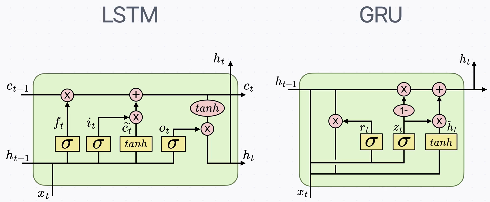
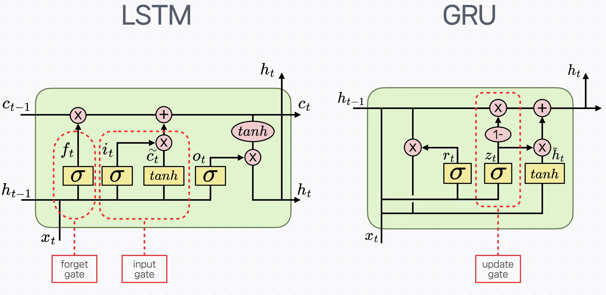
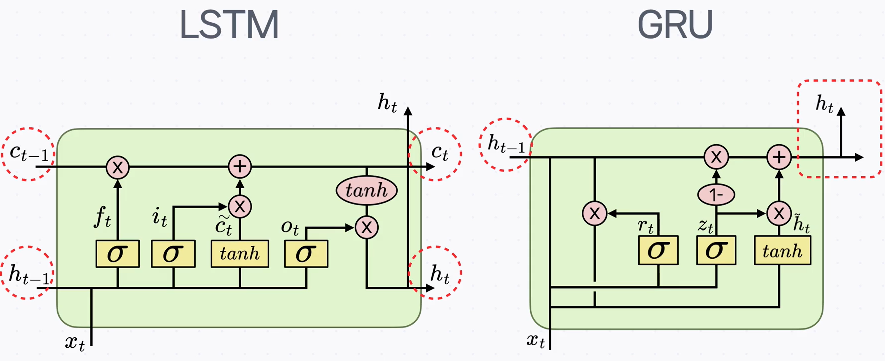
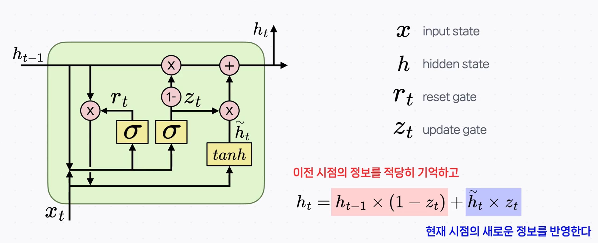
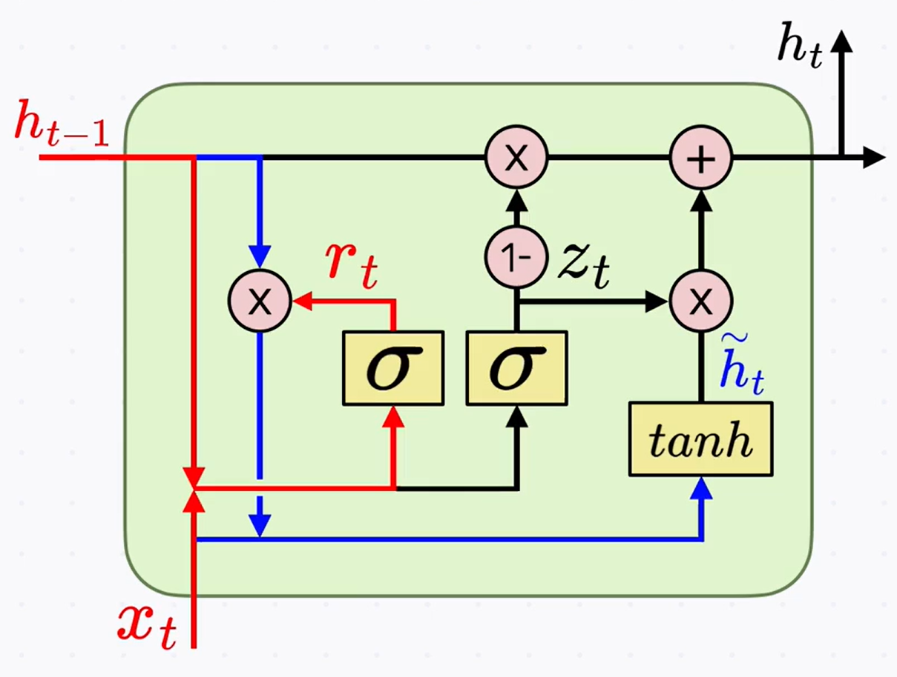
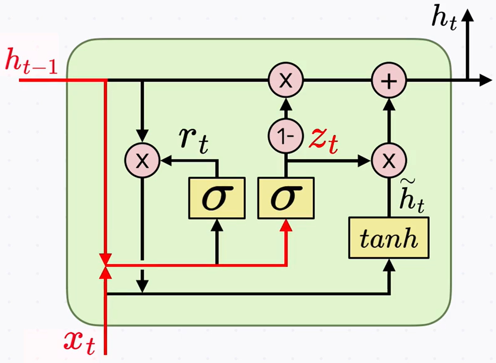
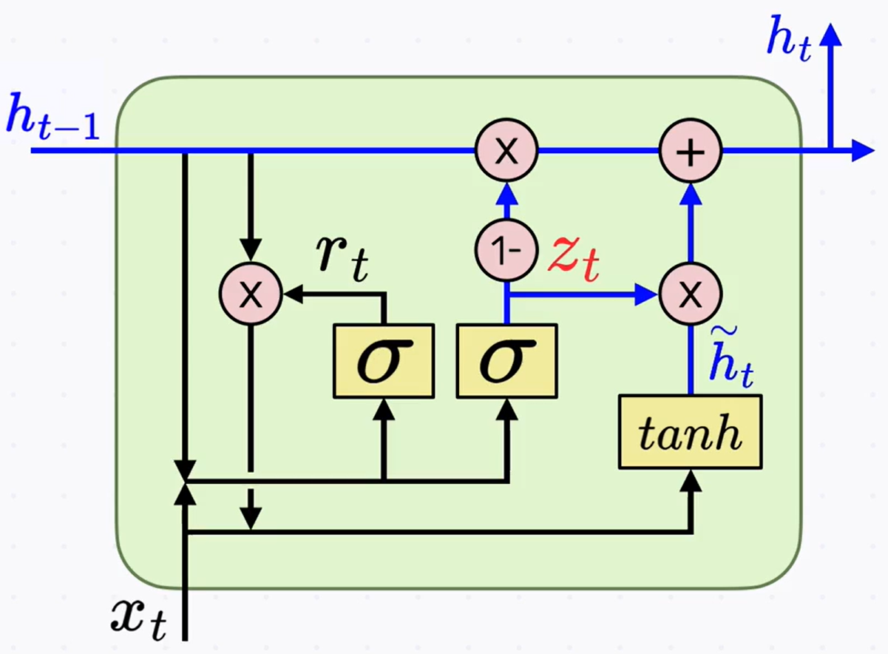

# GRU(Gated Recurrent Unit)

## 1) 왜 GRU인가 (배경)

이전에 살펴본 **LSTM**은 장기 의존성(Long-term dependency) 문제를 완화하지만, **구조가 복잡**해 계산·학습 효율 측면에서 부담이 있습니다. 이를 보완하기 위해 **구조를 단순화**한 모델이 **GRU**입니다.

LSTM의 아이디어를 따르되, 계산과 학습 효율을 높이기 위해 **게이트 수와 상태 표현을 줄여** 단순화했습니다.

LSTM에는 **forget/input/output** 3개 게이트가 있지만, GRU에는 **reset**과 **update** 두 게이트만 있습니다. 특히 **update gate**가 LSTM의 **input+forget** 역할을 함께 수행합니다.

또한 LSTM은 기억(**cell state**)과 출력(**output state**)이 분리되어 있으나, **GRU는 이를 하나의 상태로 통합**해 더 단순합니다.

---

## 2) GRU의 개념과 구조

**핵심 개념 한 줄 요약**

> GRU는 **이전 시점의 정보를 적당히 기억**하고 **현재 시점의 새 정보를 반영**합니다.

> **표기 간단 정리** > $x_t$: 현재 입력, $h_{t-1}$: 이전 시점의 상태, $\tilde{h}_t$: 현재 시점의 **후보** 상태,
> $r_t$: **reset gate**, $z_t$: **update gate**, $h_t$: 최종 상태

---

### (1) $\tilde{h}_t$ — 현재 시점의 “후보” 상태

$$
\tilde{h}_t = \tanh\!\big(W_{hh}(r_t\,h_{t-1}) + W_{xh}x_t\big)
$$

- $\tilde{h}_t$는 **현재 시점에 집중**한 **후보 특성**입니다.
- $r_t$는 과거 정보 $h_{t-1}$를 **얼마나 잊고 반영할지**를 조절합니다.
- 결과적으로 $\tilde{h}_t$는 **기존 기억을 일부 지우고** $x_t$의 정보를 받아들인 값입니다.

---

### (2) $z_t$ — 이전/현재 정보를 섞는 “비율”

- **update gate** $z_t$는 이전 상태 $h_{t-1}$와 후보 상태 $\tilde{h}_t$를 **어떤 비율로 섞을지**를 정합니다.
- 비율 결정에는 $h_{t-1}$과 $x_t$가 함께 사용됩니다.

---

### (3) $h_t$ — 최종 상태

- 최종 **hidden state** $h_t$는 **이전 상태 $h_{t-1}$** 와 **후보 $\tilde{h}_t$** 를 **$z_t$ 비율**에 따라 섞어 얻습니다.
- 즉, **과거에서 온 정보**와 **현재에서 추출한 정보**를 **적절히 혼합**해 다음 시점으로 전달합니다.

---

## 3) 마무리: GRU의 위치 잡기

GRU는 **시간이 지나며 정보가 소실되는 문제**를 완화하도록 설계되어, **먼 과거의 상태/입력**도 학습과 추론에 활용할 수 있게 도와줍니다. 다만 LSTM과 마찬가지로 **Long-term dependency를 완전히 해결**한 것은 아니며, **최근 자연어 처리에서는 Transformer 기반 대규모 언어 모델**이 뚜렷이 강세입니다.
그럼에도 **간단한 작업**에서는 RNN 계열만으로도 충분히 좋은 성능을 낼 수 있고, 이해가 쉬워 **여러 도메인**에서 여전히 유용하게 쓰입니다. RNN을 이해해 두면 **후속 모델을 이해**하는 데에도 큰 도움이 됩니다.

---

## 핵심 요약

- **GRU = 단순화된 LSTM**: 게이트를 **reset/update 두 개**로 줄이고, **상태를 하나로 통합**.
- $\tilde{h}_t$는 현재에 집중한 **후보 상태**, $r_t$로 **과거 반영 정도**를 조절.
- $z_t$가 **이전 상태와 후보 상태의 혼합 비율**을 정해 **최종 $h_t$** 를 만든다.
- 장기 의존성 완화에 도움을 주지만 **완전한 해결책은 아니며**, 최근에는 **Transformer**가 강세.
