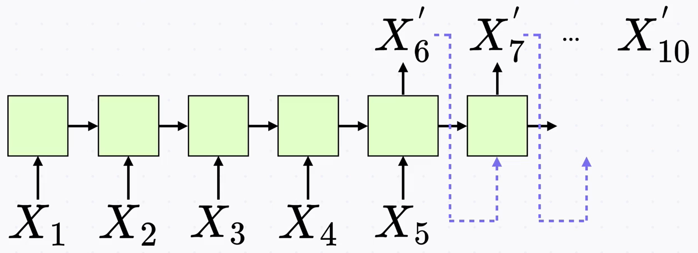
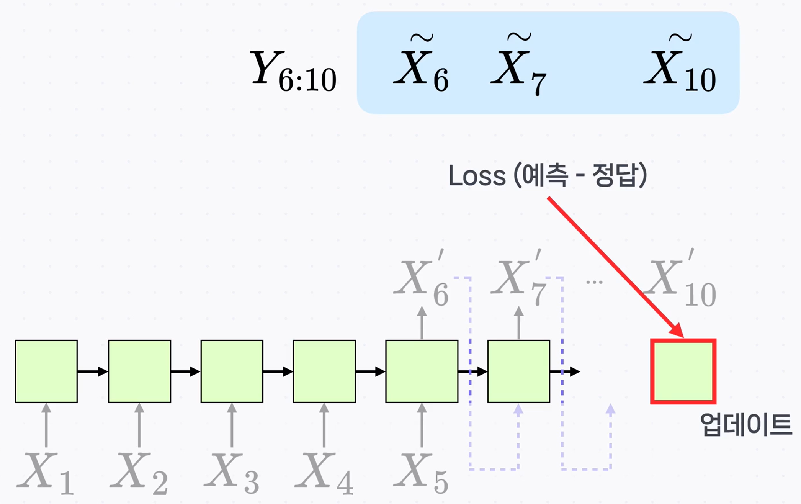

# RNN 활용 예시: 시계열(날씨) 예측

## 1) 문제 정의

- **목표**: 과거의 관측 시퀀스 $X_1, X_2, \dots$ 를 바탕으로 **미래 시점의 값** $X_6, X_7, \dots$ 을 예측한다.
- **데이터 예**: 한 시점 $X_t$ 는 온도·습도·기압 등 여러 변수가 묶인 벡터(특성들의 모음)이다.

> 표기 정리
>
> - $X_t$: $t$번째 **실제 관측값(입력)**
> - $X_t'$: 모델이 만든 **예측값**
> - $\tilde{X}_t$: 예측과 비교할 **정답(타깃)**
> - $Y_{6:10}$: $\{\tilde{X}_6,\tilde{X}_7,\dots,\tilde{X}_{10}\}$ 의 묶음

---

## 2) 모델링(구조)

아래처럼 **RNN 셀을 시간축으로 펼친(unrolled) 구조**를 사용한다.
처음 5개 입력 $X_1\!\sim\!X_5$ 를 넣고, 그다음부터는 **직전 예측을 다음 입력으로 다시 넣어** 연쇄적으로 예측을 만든다(오토리그레시브 방식).

- 마지막(5번째) 셀의 출력이 $X_6'$.
- $X_6'$ 를 다음 셀의 입력으로 사용해 $X_7'$ 생성 … 이런 식으로 $X_{10}'$ 까지 확장한다.
- 이 과정은 **many-to-many** 형태(입력 5개 → 출력 5개)로 볼 수 있다.

---

## 3) 훈련(손실과 역전파)

예측 $X_6'\!\sim\!X_{10}'$ 과 **정답 $Y_{6:10}$** 의 차이로 **손실(loss)** 을 계산해, 시간축을 따라 **역전파**로 가중치를 갱신한다.

- 손실을 맨 마지막 시점에서 계산 → **이전 시점으로 차례로 전파**되어 모든 시점의 같은 RNN 가중치가 갱신된다.
- “하나의 recurrent unit”을 10스텝으로 펼친 것이므로, **같은 가중치 집합**이 여러 시점의 그래프에서 반복하여 업데이트된다.

---

## 4) 데이터 준비(슬라이딩 윈도우)

- 예를 들어 길이 100의 시퀀스가 있을 때, **입력 5 + 출력 5 = 총 길이 10** 으로 묶는다.
- **겹치지 않게** 나누면 대략 $100/10 = 10$개의 묶음만 생성된다.
- **겹치도록**(슬라이딩) 묶으면 **학습 샘플 수를 크게 늘릴 수 있다.**
- 이후 **Train / Validation** 으로 분리해 학습을 진행한다.

---

## 5) 추론(예측 사용법)

- 실제 사용 시에는 **초기 관측 5개** $X_1\!\sim\!X_5$ 를 넣고,
- 그다음부터는 **모델 출력 $X_t'$** 를 **다음 시점 입력**으로 계속 사용하여 $X_6', X_7', \dots$ 를 순차적으로 얻는다.

---

## 6) 수식·기호 간단 설명

- $X_t$: $t$시점 실제 입력(온도·습도·기압 등 특성 벡터)
- $X_t'$: 모델 예측
- $\tilde{X}_t$: 정답(라벨)
- $Y_{6:10}=\{\tilde{X}_6,\dots,\tilde{X}_{10}\}$: 예측 구간의 라벨 묶음
- **문맥에서의 역할**: $X_t'$ 와 $\tilde{X}_t$ 의 차이(손실)를 이용해 RNN 가중치를 **시간축 전반에 걸쳐** 업데이트한다.

---

## 핵심 요약

- **입력 5개 → 출력 5개** 형태로 RNN을 시간축에 펼쳐 **연쇄 예측**을 수행한다.
- 예측 $X_t'$ 와 정답 $\tilde{X}_t$ 의 **손실**을 계산해 **역전파**로 모든 시점의 **같은 가중치**를 갱신한다.
- 데이터는 길이 10 윈도우로 묶고, **겹치게 구성**하면 학습 샘플을 더 많이 만들 수 있다.
- 실제 예측 시에는 **초기 관측** 후 모델 출력을 **다음 입력으로 순환**시켜 미래 시점을 생성한다.
