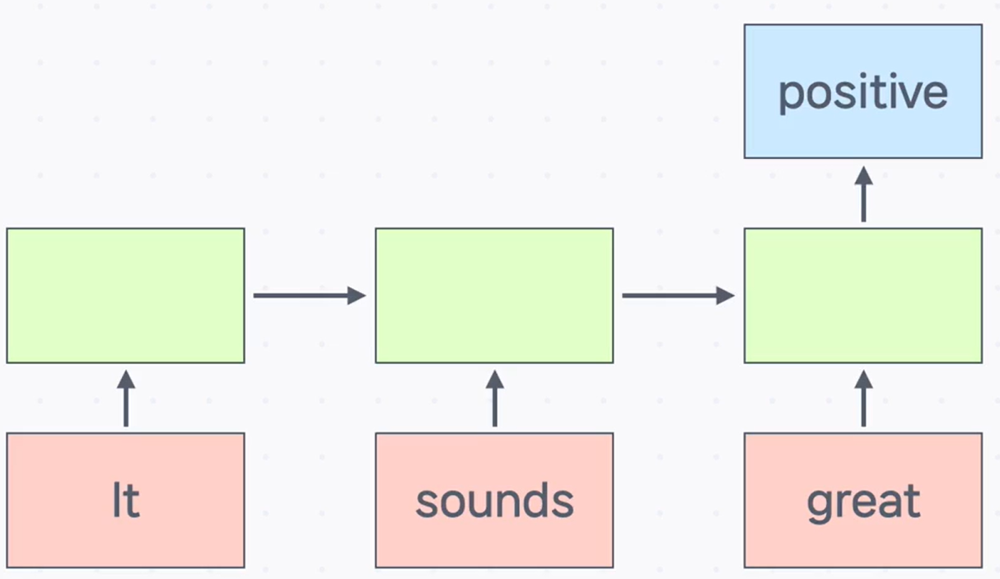
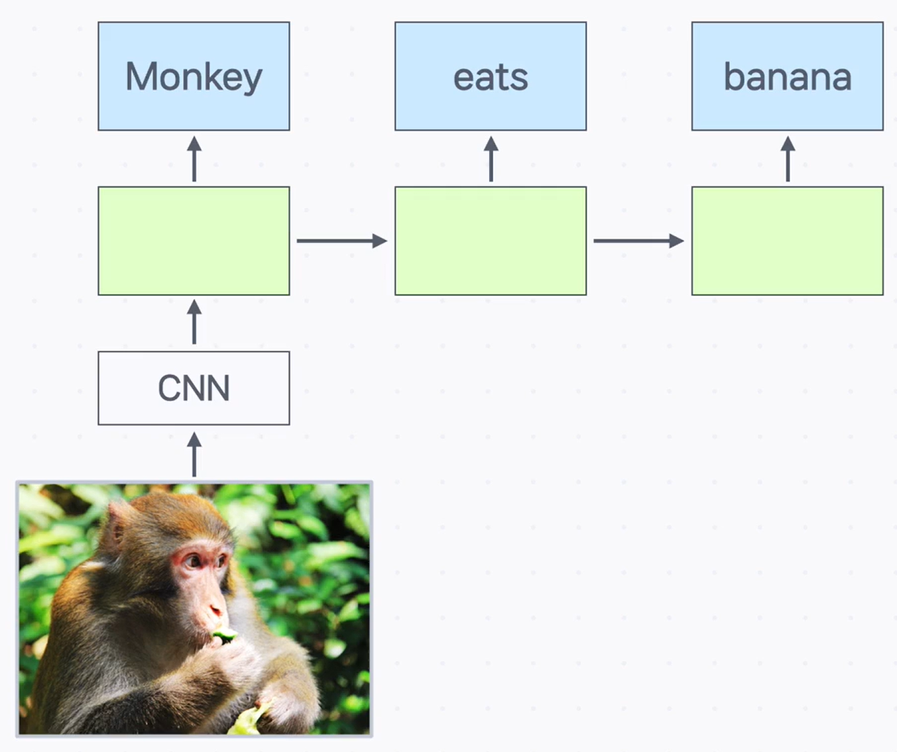

# Encoder와 Decoder

## 1) 왜 Encoder/Decoder가 필요한가

이미지·텍스트처럼 사람이 이해하는 정보를 **컴퓨터가 다룰 수 있는 형태로 변환**해야 합니다. 이때 두 축이 **Encoder(인코더)** 와 **Decoder(디코더)** 입니다.

- **Encoder**: 사람이 읽는 구체 정보 → **추상적·압축된 표현**으로 변환
  (핵심 특성을 잡아 **저차원 표현**으로 요약)
- **Decoder**: 추상적 표현 → 사람이 해석 가능한 **구체 정보**로 복원
  (압축된 표현을 **고차원 데이터**로 되돌림)

---

## 2) RNN 구조로 이해하는 Encoder/Decoder

RNN의 두 형태를 통해 역할을 직관적으로 볼 수 있습니다.

### many to one → **Encoder 역할**

여러 시점의 입력을 받아 **하나의 출력**을 만드는 구조입니다.
많은 정보를 **하나의 벡터로 압축**하므로 **인코더 역할**이라고 볼 수 있습니다.

### one to many → **Decoder 역할**

**하나의 입력**에서 **여러 시점의 출력**을 만들어 냅니다.
압축된 표현을 **여러 토큰/단계로 펼쳐내는** 특성상 **디코더 역할**로 이해할 수 있습니다.

---

## 3) 인코더–디코더가 작업을 돕는 방식

- **내부 표현 활용**: 인코더는 입력을 **고정 길이 벡터** 같은 내부 표현으로 바꿔, 불필요한 정보를 줄이고 **핵심 특징을 포착**합니다.
- **복원/변환**: 디코더는 이 표현을 이용해 **원래 형태로 복원**하거나 **원하는 다른 형태**(예: 결과물 포맷)로 변환합니다.
- **예시**:

  - 손그림으로 된 **‘3’** 과 **‘6’** 을 인코더에 통과시켜 **압축 표현**을 얻는다.
  - 두 표현을 간단한 연산으로 결합해 **‘9’를 의미하는 표현**을 만든다.
  - 이 표현을 디코더에 넣어 **‘9’ 그림**으로 복원한다.

- **응용**: 인코더–디코더를 활용해 **노이즈가 있는 이미지를 복원**(노이즈 제거)하는 식으로도 사용할 수 있다.

---

## 핵심 요약

- **Encoder**: 입력을 **압축·추상화**해 핵심 특성을 담은 표현으로 바꾼다.
- **Decoder**: 압축 표현을 **원래/원하는 형태로 복원**한다.
- RNN 관점에서 **many to one은 인코더**, **one to many는 디코더** 역할로 이해할 수 있다.
- 인코더–디코더 조합으로 **내부 표현을 조작**해 원하는 결과(예: 숫자 그림 합성, 노이즈 제거)를 얻는다.
