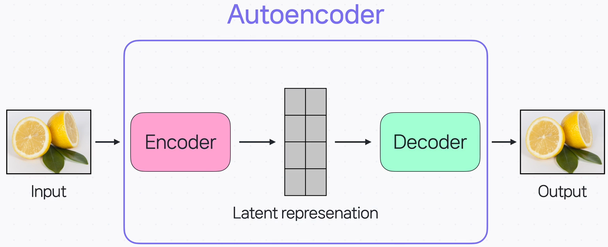
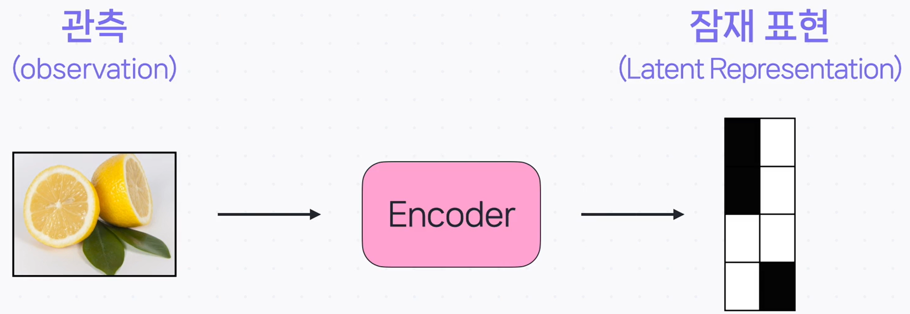
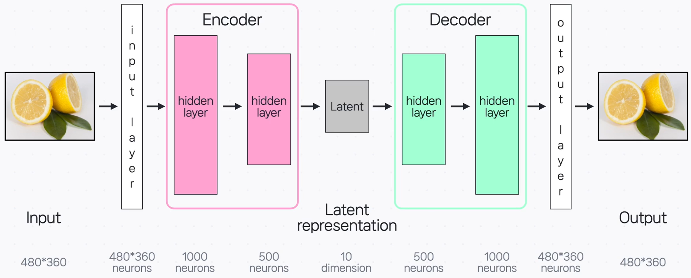
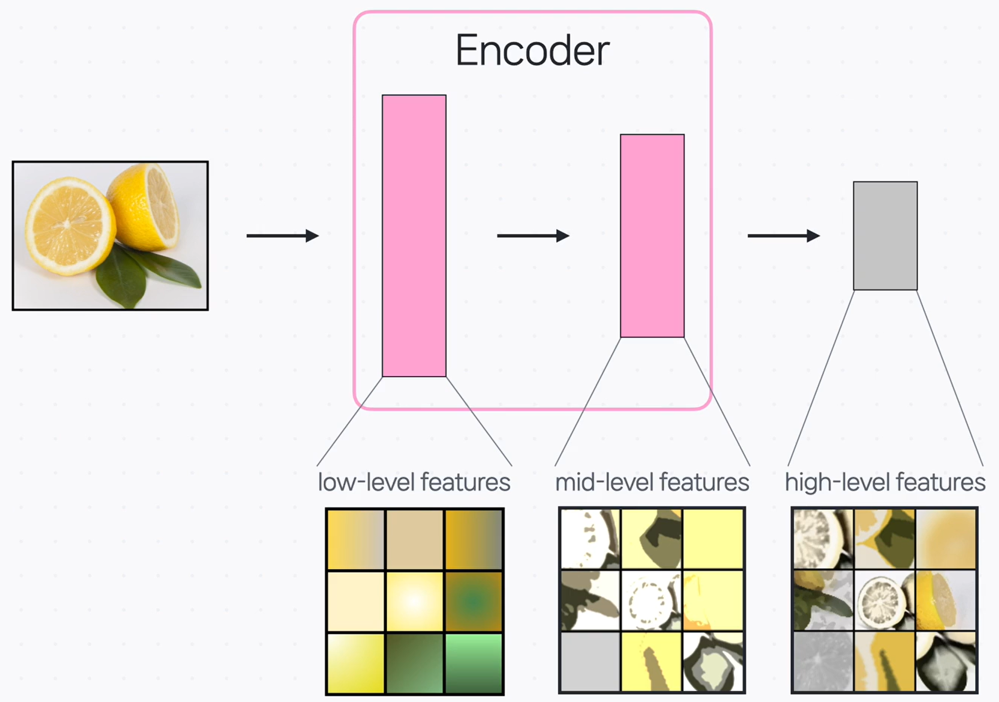

# Autoencoder (오토인코더) 입문 가이드

## Autoencoder란?

> **정의**: Autoencoder는 **입력을 그대로 재현(reconstruction)** 하도록 학습하는 **비지도 학습 신경망**입니다.
> 인코더가 입력을 **압축된 잠재 표현(latent representation)** 으로 바꾸고, 디코더가 이를 다시 **입력과 유사한 출력**으로 복원합니다.

- 인코더+디코더를 **연결한 구조**로, 데이터를 **효율적으로 표현(차원 축소)** 하거나 **중요 특징을 추출**하는 데 쓰입니다.
- Autoencoder는 **인코더·디코더를 활용한 대표 모델**입니다.

---

## Latent Representation(잠재 표현)

> **정의**: 입력의 **중요 특징만 압축**해 담은 **잠재적 표현(주로 벡터)**. _Latent vector_, *feature*라고도 부릅니다.

- “잠재”는 **관측값에 드러나지 않는 숨은 정보**라는 뜻입니다.
- 같은 데이터를 **관측(observation)** 과 **잠재 표현(latent)** 으로 대비하면 아래처럼 이해할 수 있습니다.

- 예: 레몬 이미지를 **관측**은 픽셀로 그대로 표현, **잠재 표현**은 “동그란 형태, 단면, 노란색” 같은 **핵심 특징 요약**으로 표현.

> 중요한 특징이 무엇인지는 **사전에 지정하지 않으며**, 인코더가 **학습 과정에서 자동으로 포착**합니다. 그래서 이름이 **Auto**encoder입니다.

---

## Autoencoder의 전체 구조

- **Input layer → (인코더 hidden layers) → Latent → (디코더 hidden layers) → Output layer**
- 인코더 구간에서 **차원을 점차 줄이며** 중요 특징을 남기고, 디코더 구간에서 **원본 형태로 복원**합니다.

### 인코딩 과정에서의 특징 포착

- 각 hidden layer를 지나며 **저수준 → 중간수준 → 고수준 특징**으로 점차 추상화됩니다.

  - 저수준: 색/밝기 등 기본 패턴
  - 중간수준: 가장자리/부분 형태
  - 고수준: 사물의 구체적 구조

---

## 어떻게 학습될까? (재구성 손실)

Autoencoder는 **입력과 복원된 출력의 차이**를 **손실(loss)** 로 두고, 이 손실이 **작아지도록** 인코더·디코더의 파라미터를 학습합니다.

- 입력을 인코더에 통과 → **잠재 표현** 생성
- 잠재 표현을 디코더에 통과 → **출력(복원본)** 생성
- **입력 vs 출력** 차이를 손실로 계산 → **역전파로 파라미터 업데이트**
- 결과적으로 **데이터의 구조를 자동 학습**하고 **유용한 특징을 추출**하게 됩니다.

---

## Autoencoder의 활용

- **Image Denoising(노이즈 제거)**

  - 노이즈: 해석을 방해하는 **무작위 추가 정보/왜곡**
  - Autoencoder가 **핵심 특징만 보존**하도록 학습되면, **노이즈가 포함된 이미지**를 넣어도 잠재 공간에서 **노이즈를 제외한 정보**를 이용해 **깨끗한 이미지를 복원**할 수 있습니다.

- **Image Generation(비슷한 데이터 생성)**

  - 학습된 잠재 표현에 **작은 변화를 주어** 원본과 **비슷하지만 새로운 데이터**를 생성하거나, **특성 조작**에 활용할 수 있습니다.

---

## 핵심 요약

- Autoencoder는 **입력 복원**을 목표로 하는 **비지도 학습** 모델로, **인코더(압축)–디코더(복원)** 로 구성됩니다.
- 인코더는 **잠재 표현**에 **중요 특징을 요약**하고, 디코더는 이를 **원본 형태로 되돌립니다**.
- 학습은 **입력–출력 차이(재구성 손실)** 를 줄이는 방식으로 진행됩니다.
- **노이즈 제거·비슷한 데이터 생성** 등에서 유용하게 쓰입니다.
