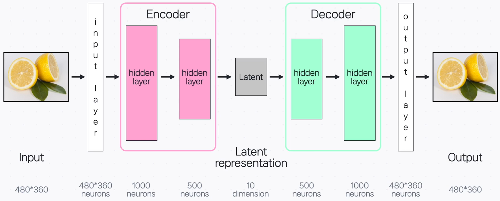
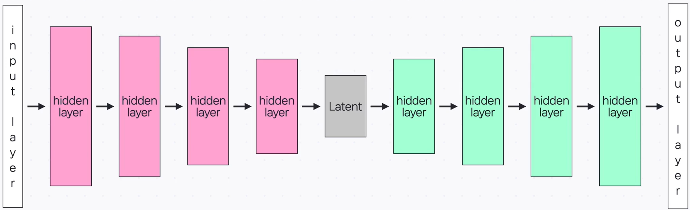

# 다양한 Autoencoder 구조 알아보기

**Autoencoder**는 입력을 **잘 재현**하도록 학습하는 신경망입니다. 인코더가 입력을 **압축(잠재 표현)** 하고, 디코더가 이를 **복원**합니다. 데이터가 복잡하면 기본 구조만으로는 표현력이 부족할 수 있어, 아래와 같은 **변형 구조**들이 사용됩니다.

---

## 1) Stacked Autoencoder

여러 개의 **hidden layer**를 **깊게** 쌓아(스택) 단계적으로 특징을 학습합니다.
→ 더 복잡한 데이터에서도 유용한 표현을 배울 수 있습니다.

---

## 2) Sparse Autoencoder

(이미지 없음)

학습 시 **일부 뉴런만** 주로 활성 되도록 제한합니다.
→ 각 뉴런이 **과적합 없이** 의미 있는 특징을 맡아 학습하도록 돕는 구조입니다.
_(설명은 원본 표현 “drop out 개념과 비슷”을 유지)_

---

## 3) Denoising Autoencoder

입력에 **노이즈**를 추가하고, 네트워크가 **원본을 복원**하도록 학습합니다.
→ 노이즈 같은 **사소한 변화**는 무시하고, **중요 특징**을 더 안정적으로 학습하게 만듭니다.

---

## 4) Contractive Autoencoder

입력이 **사소하게 변해도** 잠재 벡터가 **큰 영향을 받지 않도록** 학습합니다.
→ 중요 특징과 무관한 작은 변화에 **덜 민감**해지며, 중요한 부분과 아닌 부분을 **구분**하는 데 도움을 줍니다.

---

## 5) VAE (Variational Autoencoder)

VAE는 잠재 표현을 **하나의 벡터가 아닌 ‘범위(분포)’** 로 학습합니다.

- 잠재 **평균 벡터**와 **표준편차 벡터**를 학습하여, 그 분포에서 **랜덤 값을 이용해 샘플**을 만듭니다.
- 이렇게 얻은 잠재 표현으로 **입력과 비슷하지만 새로운 데이터**를 생성합니다.

> 원문 예시: 레몬 이미지로 학습했다면, 평균 벡터는 **공통적인 노란 원형** 같은 핵심 특징을 담고, 표준편차 벡터는 **개수·잎 유무·자른 형태·위치/크기**처럼 달라질 수 있는 요소를 담습니다. 랜덤 값을 섞어 **새로운 레몬 이미지**를 만들 수 있습니다.

---

## 핵심 요약

- Autoencoder는 **인코더(압축)–디코더(복원)** 구조로 입력을 재현하며, 데이터 표현을 학습한다.
- **Stacked**: 레이어를 깊게 쌓아 복잡한 데이터의 특징을 단계적으로 학습.
- **Sparse**: 일부 뉴런만 주로 활성 되게 하여 과적합을 줄이고 의미 있는 특징을 학습.
- **Denoising**: 노이즈가 있어도 원본을 복원하게 만들어 중요한 특징을 견고하게 학습.
- **Contractive**: 입력의 작은 변화에 잠재 표현이 덜 흔들리게 학습.
- **VAE**: 잠재 공간을 분포로 학습해, **비슷하지만 새로운 데이터**를 생성.
