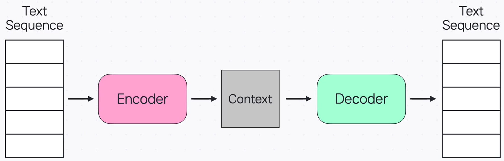
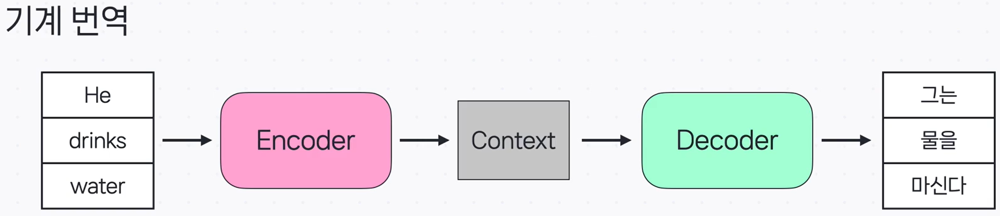
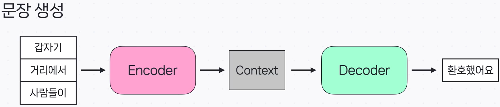
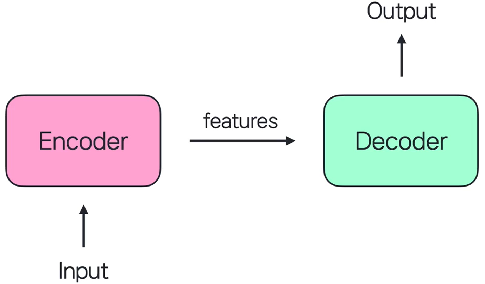
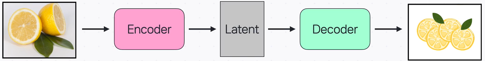
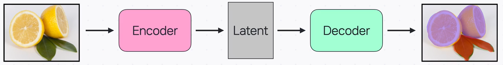
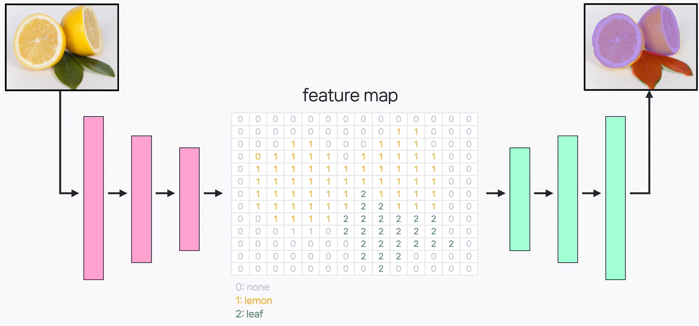
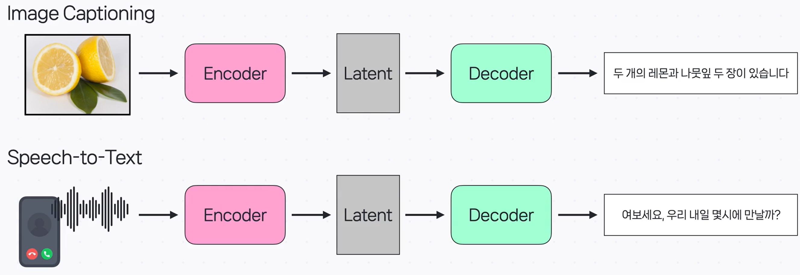

# Encoder와 Decoder의 활용 분야

인코더–디코더(Encoder–Decoder)는 **입력을 잠재 표현(내부 특징)으로 바꾸는 인코더**와, **그 잠재 표현을 원하는 출력으로 되돌리는 디코더**가 하나의 흐름으로 이어진 구조입니다. Autoencoder 말고도 다양한 딥러닝 문제에서 널리 쓰입니다.

---

## NLP (자연어 처리)

자연어 처리에서는 **인코더가 입력 문장을 잠재 표현(= 문맥, _context_)으로 요약**하고, **디코더가 그 표현을 바탕으로 출력 문장을 생성**합니다.

### Machine Translation (기계 번역)

- 한 언어의 문장을 받아 **같은 의미의 다른 언어 문장**을 만들어 냅니다.

### Sentence Generation (문장 생성)

- 주어진 문장 뒤에 **자연스럽게 이어질 문장**을 생성하도록 학습합니다.

### Transformer

- 최근 자연어 처리에서 널리 쓰이는 **Transformer**도 인코더–디코더 아이디어를 바탕으로 합니다.
- 이 구조를 토대로 **GPT 같은 대규모 언어 모델(LLM)** 이 발전하고 있습니다.

---

## 이미지 처리(Image Processing)

인코더–디코더로 이미지를 **특징으로 압축**하고, 다시 **이미지 형태로 복원**하며 다양한 작업을 수행합니다.

### Image Generation (이미지 생성)

- 예: **VAE(Variational Autoencoder)** 는 인코더로 입력 이미지의 **잠재 표현 분포**를 얻고, 디코더로 **새로운 이미지**를 생성합니다.

### Image Segmentation (시맨틱 분할)

- 인코더가 이미지의 **공간·의미 정보를 담은 feature map**을 뽑고, 디코더가 이를 이용해 **픽셀 단위로 영역을 분류**합니다. 아래 그림처럼 레몬과 나뭇잎이 서로 다른 색의 마스크로 구분됩니다.

작동 원리 한눈에 보기 

- **인코더**: 차원을 줄이며 의미 있는 **feature map**을 추출
- **디코더**: 차원을 다시 넓혀 feature를 **원본 해상도에 투영**, 각 픽셀을 분류

---

## 크로스 모달 처리(Cross Modal Processing)

서로 **다른 유형(모달리티)의 데이터**를 연결합니다.

- **Image Captioning**: 이미지 → (인코더) → 잠재 표현 → (디코더) → **텍스트 설명**
- **Speech-to-Text**: 음성 신호 → (인코더) → 잠재 표현 → (디코더) → **텍스트 전사**

---

## 핵심 요약

- 인코더–디코더는 **입력 → 잠재 표현 → 출력**의 흐름으로 다양한 데이터 유형을 다룹니다.
- NLP에서는 기계 번역·문장 생성, 이미지 분야에서는 생성·시맨틱 분할에 폭넓게 활용됩니다.
- Transformer 역시 인코더–디코더 아이디어를 바탕으로 하며, 대규모 언어 모델의 기반이 됩니다.
- 크로스 모달 작업(예: 이미지 캡셔닝, 음성 인식)에서도 **서로 다른 모달리티를 연결**하는 핵심 구조입니다.
